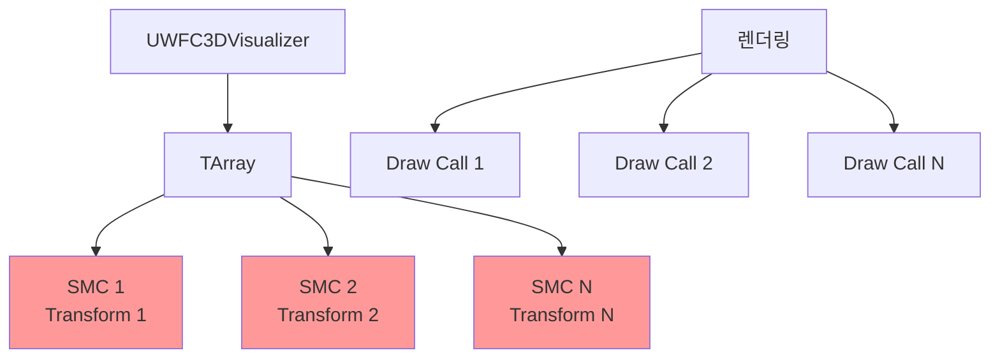
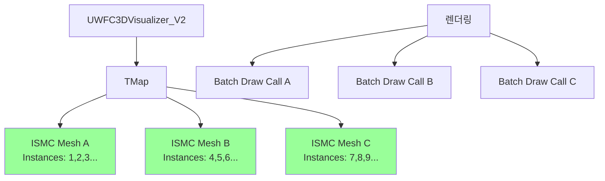
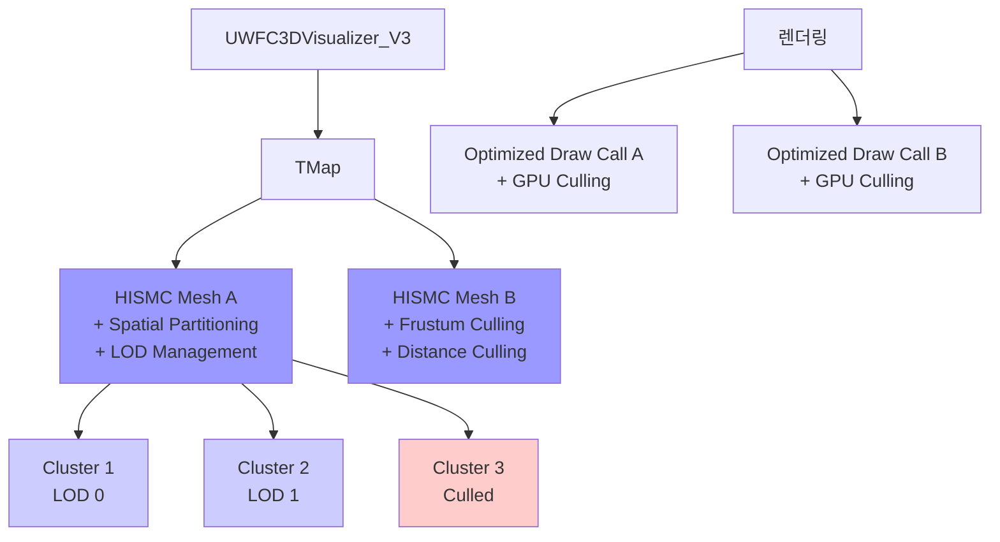

# 🔄 WFC3D Visualizer 마이그레이션 구현 계획

## 📋 목차
- [🎯 마이그레이션 전략 개요](#-마이그레이션-전략-개요)
- [📊 아키텍처 진화 다이어그램](#-아키텍처-진화-다이어그램)
- [🔧 Phase 1: ISMC 구현 세부계획](#-phase-1-ismc-구현-세부계획)
- [⚡ Phase 2: HISMC 구현 세부계획](#-phase-2-hismc-구현-세부계획)
- [🧪 테스트 및 검증 계획](#-테스트-및-검증-계획)
- [🚀 배포 및 롤백 전략](#-배포-및-롤백-전략)

---

## 🎯 마이그레이션 전략 개요

### 핵심 원칙
1. **무중단 마이그레이션**: 기존 기능 손실 없이 단계적 전환
2. **성능 검증**: 각 단계별 벤치마크 통과 후 다음 단계 진행
3. **호환성 유지**: 기존 블루프린트 및 C++ 코드와 100% 호환
4. **안전한 롤백**: 문제 발생 시 즉시 이전 버전으로 복구 가능

### 전환 플래그 시스템
```cpp
// WFC3DVisualizerConfig.h
enum class EWFCRenderingMode : uint8 {
    StaticMesh = 0,           // 기존 방식 (안정성 우선)
    InstancedStaticMesh = 1,  // Phase 1 (성능 개선)
    HierarchicalISM = 2,      // Phase 2 (최고 성능)
    Auto = 3                  // 자동 선택 (그리드 크기 기반)
};

// 글로벌 설정으로 런타임 전환 가능
UPROPERTY(EditAnywhere, BlueprintReadWrite, Category = "WFC Rendering")
EWFCRenderingMode RenderingMode = EWFCRenderingMode::Auto;
```

---

## 📊 아키텍처 진화 다이어그램

### 현재 아키텍처 (StaticMeshComponent)


### Phase 1 아키텍처 (InstancedStaticMeshComponent)


### Phase 2 아키텍처 (HierarchicalInstancedStaticMeshComponent)


---

## 🔧 Phase 1: ISMC 구현 세부계획

### 1.1 핵심 인터페이스 설계

```cpp
// IWFCRenderingStrategy.h - 전략 패턴 인터페이스
class PROCEDURALWORLD_API IWFCRenderingStrategy {
public:
    virtual ~IWFCRenderingStrategy() = default;
    
    // 필수 인터페이스
    virtual void Initialize(AActor* OwnerActor, float TileSize) = 0;
    virtual void VisualizeGrid(UWFC3DGrid* Grid, UWFC3DModelDataAsset* ModelData) = 0;
    virtual void ClearVisualization() = 0;
    virtual void SetTileSize(float NewTileSize) = 0;
    
    // 성능 모니터링
    virtual FWFCRenderingStats GetRenderingStats() const = 0;
    virtual bool SupportsGridSize(const FIntVector& Dimensions) const = 0;
    
    // 전략 정보
    virtual EWFCRenderingMode GetRenderingMode() const = 0;
    virtual FString GetStrategyName() const = 0;
};

// 렌더링 통계 구조체
struct PROCEDURALWORLD_API FWFCRenderingStats {
    int32 TotalInstances = 0;
    int32 DrawCalls = 0;
    int32 VisibleInstances = 0;
    float MemoryUsageMB = 0.0f;
    float LastRenderTimeMs = 0.0f;
    TMap<UStaticMesh*, int32> MeshInstanceCounts;
};
```

### 1.2 ISMC 구현체

```cpp
// WFC3DVisualizer_ISMC.h
class PROCEDURALWORLD_API UWFC3DVisualizer_ISMC : public UObject, public IWFCRenderingStrategy {
    GENERATED_BODY()

public:
    // IWFCRenderingStrategy 인터페이스 구현
    virtual void Initialize(AActor* OwnerActor, float TileSize) override;
    virtual void VisualizeGrid(UWFC3DGrid* Grid, UWFC3DModelDataAsset* ModelData) override;
    virtual void ClearVisualization() override;
    virtual void SetTileSize(float NewTileSize) override;
    virtual FWFCRenderingStats GetRenderingStats() const override;
    virtual bool SupportsGridSize(const FIntVector& Dimensions) const override;
    virtual EWFCRenderingMode GetRenderingMode() const override { return EWFCRenderingMode::InstancedStaticMesh; }
    virtual FString GetStrategyName() const override { return TEXT("InstancedStaticMesh"); }

protected:
    // ISMC 관리
    void CreateISMCComponents(const TMap<UStaticMesh*, TArray<FWFCInstanceData>>& MeshInstanceMap);
    void UpdateInstanceTransforms();
    void OptimizeMaterialBatching();
    
    // 성능 최적화
    void PreallocateInstanceBuffers(int32 EstimatedInstanceCount);
    void BatchUpdateInstances();
    
private:
    UPROPERTY()
    AActor* OwnerActor = nullptr;
    
    UPROPERTY()
    TMap<UStaticMesh*, UInstancedStaticMeshComponent*> MeshToISMCMap;
    
    // 인스턴스 데이터 관리
    struct FISMCBatch {
        UInstancedStaticMeshComponent* Component;
        TArray<FTransform> PendingTransforms;
        TArray<UMaterialInterface*> Materials;
        bool bNeedsUpdate = false;
        
        void FlushUpdates();
        void AddInstance(const FTransform& Transform);
        void RemoveInstance(int32 InstanceIndex);
    };
    
    TMap<UStaticMesh*, FISMCBatch> ISMCBatches;
    
    float TileSize = 100.0f;
    mutable FWFCRenderingStats CachedStats;
    
    // 성능 모니터링
    mutable float LastStatsUpdateTime = 0.0f;
    static constexpr float STATS_UPDATE_INTERVAL = 0.5f;
};
```

### 1.3 핵심 로직 구현

```cpp
// WFC3DVisualizer_ISMC.cpp - 핵심 메서드 구현
void UWFC3DVisualizer_ISMC::VisualizeGrid(UWFC3DGrid* Grid, UWFC3DModelDataAsset* ModelData) {
    if (!Grid || !ModelData || !OwnerActor) return;
    
    SCOPE_CYCLE_COUNTER(STAT_WFC3D_VisualizeGrid_ISMC);
    
    // 1. 기존 시각화 정리
    ClearVisualization();
    
    // 2. 메시별 인스턴스 데이터 수집
    TMap<UStaticMesh*, TArray<FWFCInstanceData>> MeshInstanceMap;
    CollectInstanceData(Grid, ModelData, MeshInstanceMap);
    
    // 3. ISMC 컴포넌트 생성
    CreateISMCComponents(MeshInstanceMap);
    
    // 4. 인스턴스 데이터 적용
    for (auto& [StaticMesh, InstanceBatch] : ISMCBatches) {
        InstanceBatch.FlushUpdates();
    }
    
    // 5. 통계 업데이트
    UpdateRenderingStats();
}

void UWFC3DVisualizer_ISMC::CollectInstanceData(
    UWFC3DGrid* Grid, 
    UWFC3DModelDataAsset* ModelData,
    TMap<UStaticMesh*, TArray<FWFCInstanceData>>& OutMeshInstanceMap) {
    
    const TArray<FWFC3DCell>& Cells = Grid->GetCells();
    const FIntVector& Dimensions = Grid->GetDimensions();
    
    // 예상 인스턴스 수로 메모리 사전 할당
    int32 EstimatedInstances = Dimensions.X * Dimensions.Y * Dimensions.Z;
    OutMeshInstanceMap.Reserve(ModelData->GetTileInfosNum());
    
    for (int32 CellIndex = 0; CellIndex < Cells.Num(); ++CellIndex) {
        const FWFC3DCell& Cell = Cells[CellIndex];
        
        if (!Cell.bIsCollapsed) continue;
        
        // 타일 정보 가져오기
        const FTileInfo* TileInfo = ModelData->GetTileInfo(Cell.CollapsedTileIndex);
        if (!TileInfo) continue;
        
        // 시각적 정보 가져오기
        const FTileVisualInfo* VisualInfo = ModelData->GetRandomTileVisualInfo(
            TileInfo->BaseTileID, 
            TEXT("Default")  // TODO: 바이옴 시스템 통합
        );
        
        if (!VisualInfo || !VisualInfo->StaticMesh) continue;
        
        // Transform 계산
        FVector WorldLocation = FVector(Cell.Location) * TileSize;
        FTransform InstanceTransform(FRotator::ZeroRotator, WorldLocation, FVector::OneVector);
        
        // 인스턴스 데이터 추가
        FWFCInstanceData InstanceData;
        InstanceData.Transform = InstanceTransform;
        InstanceData.Materials = VisualInfo->Materials;
        InstanceData.GridLocation = Cell.Location;
        InstanceData.TileIndex = Cell.CollapsedTileIndex;
        
        TArray<FWFCInstanceData>& InstanceArray = OutMeshInstanceMap.FindOrAdd(VisualInfo->StaticMesh);
        InstanceArray.Add(InstanceData);
    }
}

void UWFC3DVisualizer_ISMC::CreateISMCComponents(
    const TMap<UStaticMesh*, TArray<FWFCInstanceData>>& MeshInstanceMap) {
    
    for (const auto& [StaticMesh, InstanceDataArray] : MeshInstanceMap) {
        if (!StaticMesh || InstanceDataArray.Num() == 0) continue;
        
        // ISMC 컴포넌트 생성
        UInstancedStaticMeshComponent* ISMC = NewObject<UInstancedStaticMeshComponent>(OwnerActor);
        ISMC->SetStaticMesh(StaticMesh);
        ISMC->SetCollisionEnabled(ECollisionEnabled::NoCollision);  // 성능 최적화
        ISMC->SetCastShadow(true);
        ISMC->SetReceivesDecals(false);  // 성능 최적화
        ISMC->AttachToComponent(OwnerActor->GetRootComponent(), 
            FAttachmentTransformRules::KeepRelativeTransform);
        
        // 배치 생성
        FISMCBatch& Batch = ISMCBatches.Add(StaticMesh);
        Batch.Component = ISMC;
        Batch.Materials = InstanceDataArray[0].Materials;  // 첫 번째 인스턴스의 머티리얼 사용
        
        // 머티리얼 적용
        for (int32 MaterialIndex = 0; MaterialIndex < Batch.Materials.Num(); ++MaterialIndex) {
            ISMC->SetMaterial(MaterialIndex, Batch.Materials[MaterialIndex]);
        }
        
        // 인스턴스 사전 할당
        ISMC->PreAllocateInstancesMemory(InstanceDataArray.Num());
        
        // 인스턴스 추가
        for (const FWFCInstanceData& InstanceData : InstanceDataArray) {
            Batch.AddInstance(InstanceData.Transform);
        }
        
        MeshToISMCMap.Add(StaticMesh, ISMC);
    }
}
```

### 1.4 성능 최적화 기능

```cpp
// 배치 업데이트 시스템
void UWFC3DVisualizer_ISMC::FISMCBatch::FlushUpdates() {
    if (!bNeedsUpdate || !Component) return;
    
    SCOPE_CYCLE_COUNTER(STAT_WFC3D_ISMC_BatchUpdate);
    
    // 기존 인스턴스 제거
    Component->ClearInstances();
    
    if (PendingTransforms.Num() > 0) {
        // 메모리 사전 할당
        Component->PreAllocateInstancesMemory(PendingTransforms.Num());
        
        // 배치로 인스턴스 추가 (더 빠름)
        for (const FTransform& Transform : PendingTransforms) {
            Component->AddInstance(Transform);
        }
        
        // GPU로 데이터 전송
        Component->MarkRenderStateDirty();
    }
    
    bNeedsUpdate = false;
}

// 자동 LOD 설정
void UWFC3DVisualizer_ISMC::ConfigureAutoLOD() {
    for (auto& [StaticMesh, ISMC] : MeshToISMCMap) {
        if (!ISMC) continue;
        
        // 거리 기반 자동 LOD 설정
        ISMC->SetCullDistances(500.0f, 5000.0f);  // Min, Max cull distances
        
        // 인스턴스별 커스텀 데이터 설정 (향후 확장용)
        ISMC->NumCustomDataFloats = 4;  // 바이옴, 변형, 등급, 예약
    }
}
```

---

## ⚡ Phase 2: HISMC 구현 세부계획

### 2.1 HISMC 전략 클래스

```cpp
// WFC3DVisualizer_HISMC.h
class PROCEDURALWORLD_API UWFC3DVisualizer_HISMC : public UWFC3DVisualizer_ISMC {
    GENERATED_BODY()

public:
    // 추가 HISMC 전용 기능
    UFUNCTION(BlueprintCallable, Category = "WFC Rendering")
    void SetLODSettings(const FWFCHISMCLODSettings& Settings);
    
    UFUNCTION(BlueprintCallable, Category = "WFC Rendering")
    void SetCullingSettings(const FWFCHISMCCullingSettings& Settings);
    
    UFUNCTION(BlueprintCallable, Category = "WFC Rendering")
    void OptimizeForLargeScale(bool bEnable);
    
    virtual EWFCRenderingMode GetRenderingMode() const override { 
        return EWFCRenderingMode::HierarchicalISM; 
    }
    virtual FString GetStrategyName() const override { 
        return TEXT("HierarchicalInstancedStaticMesh"); 
    }
    virtual bool SupportsGridSize(const FIntVector& Dimensions) const override {
        // HISMC는 매우 큰 그리드도 지원
        int32 TotalCells = Dimensions.X * Dimensions.Y * Dimensions.Z;
        return TotalCells <= 1000000;  // 100만 셀까지 지원
    }

protected:
    // HISMC 전용 메서드
    virtual void CreateISMCComponents(const TMap<UStaticMesh*, TArray<FWFCInstanceData>>& MeshInstanceMap) override;
    void ConfigureLODSystem();
    void ConfigureCullingSystem();
    void OptimizeSpatialPartitioning();
    
private:
    UPROPERTY(EditAnywhere, Category = "HISMC Settings")
    FWFCHISMCLODSettings LODSettings;
    
    UPROPERTY(EditAnywhere, Category = "HISMC Settings")
    FWFCHISMCCullingSettings CullingSettings;
    
    struct FHISMCManager {
        UHierarchicalInstancedStaticMeshComponent* HISMC = nullptr;
        FWFCHISMCLODSettings LODSettings;
        FWFCHISMCCullingSettings CullingSettings;
        bool bNeedsTreeRebuild = false;
        float LastOptimizationTime = 0.0f;
        
        void RebuildTreeIfNeeded();
        void UpdateLODDistances();
        void UpdateCullingSettings();
    };
    
    TMap<UStaticMesh*, FHISMCManager> HISMCManagers;
    
    bool bLargeScaleOptimization = false;
    float LastGlobalOptimizationTime = 0.0f;
    static constexpr float GLOBAL_OPTIMIZATION_INTERVAL = 2.0f;
};

// HISMC 설정 구조체들
USTRUCT(BlueprintType)
struct PROCEDURALWORLD_API FWFCHISMCLODSettings {
    GENERATED_BODY()
    
    UPROPERTY(EditAnywhere, BlueprintReadWrite, Category = "LOD")
    TArray<float> LODDistances = {1000.0f, 3000.0f, 8000.0f};
    
    UPROPERTY(EditAnywhere, BlueprintReadWrite, Category = "LOD")
    bool bEnableDistanceCulling = true;
    
    UPROPERTY(EditAnywhere, BlueprintReadWrite, Category = "LOD")
    float MaxDrawDistance = 10000.0f;
    
    UPROPERTY(EditAnywhere, BlueprintReadWrite, Category = "LOD")
    bool bEnablePerInstanceFade = true;
    
    UPROPERTY(EditAnywhere, BlueprintReadWrite, Category = "LOD")
    float FadeOutStartDistance = 8000.0f;
    
    UPROPERTY(EditAnywhere, BlueprintReadWrite, Category = "LOD")
    float FadeOutEndDistance = 10000.0f;
};

USTRUCT(BlueprintType)
struct PROCEDURALWORLD_API FWFCHISMCCullingSettings {
    GENERATED_BODY()
    
    UPROPERTY(EditAnywhere, BlueprintReadWrite, Category = "Culling")
    bool bEnableFrustumCulling = true;
    
    UPROPERTY(EditAnywhere, BlueprintReadWrite, Category = "Culling")
    bool bEnableOcclusionCulling = true;
    
    UPROPERTY(EditAnywhere, BlueprintReadWrite, Category = "Culling")
    int32 MaxInstancesPerLeaf = 1024;
    
    UPROPERTY(EditAnywhere, BlueprintReadWrite, Category = "Culling")
    float ClusterCullDistance = 5000.0f;
    
    UPROPERTY(EditAnywhere, BlueprintReadWrite, Category = "Culling")
    bool bUseAsyncBuildTree = true;
    
    UPROPERTY(EditAnywhere, BlueprintReadWrite, Category = "Culling")
    float TreeRebuildInterval = 5.0f;
};
```

### 2.2 고급 최적화 로직

```cpp
// WFC3DVisualizer_HISMC.cpp - 고급 기능 구현
void UWFC3DVisualizer_HISMC::CreateISMCComponents(
    const TMap<UStaticMesh*, TArray<FWFCInstanceData>>& MeshInstanceMap) {
    
    for (const auto& [StaticMesh, InstanceDataArray] : MeshInstanceMap) {
        if (!StaticMesh || InstanceDataArray.Num() == 0) continue;
        
        // HISMC 컴포넌트 생성
        UHierarchicalInstancedStaticMeshComponent* HISMC = 
            NewObject<UHierarchicalInstancedStaticMeshComponent>(OwnerActor);
        
        // 기본 설정
        HISMC->SetStaticMesh(StaticMesh);
        HISMC->SetCollisionEnabled(ECollisionEnabled::NoCollision);
        HISMC->SetCastShadow(true);
        HISMC->SetReceivesDecals(false);
        HISMC->AttachToComponent(OwnerActor->GetRootComponent(), 
            FAttachmentTransformRules::KeepRelativeTransform);
        
        // HISMC 전용 최적화 설정
        HISMC->SetCullDistances(LODSettings.FadeOutStartDistance, LODSettings.MaxDrawDistance);
        HISMC->bUseAsyncBuildTree = CullingSettings.bUseAsyncBuildTree;
        HISMC->InstanceCountToRender = FMath::Min(InstanceDataArray.Num(), 10000);
        
        // 클러스터링 설정
        HISMC->SetClusterSettings(
            CullingSettings.MaxInstancesPerLeaf,   // MaxInstancesPerLeaf
            16,                                     // MaxClustersPerLevel
            true                                    // bDisableCollision
        );
        
        // LOD 거리 설정
        if (LODSettings.LODDistances.Num() > 0) {
            for (int32 LODIndex = 0; LODIndex < LODSettings.LODDistances.Num(); ++LODIndex) {
                HISMC->SetLODDistanceScale(LODIndex, LODSettings.LODDistances[LODIndex]);
            }
        }
        
        // 대규모 최적화가 활성화된 경우 추가 설정
        if (bLargeScaleOptimization) {
            ConfigureLargeScaleOptimizations(HISMC, InstanceDataArray.Num());
        }
        
        // 매니저 생성 및 등록
        FHISMCManager& Manager = HISMCManagers.Add(StaticMesh);
        Manager.HISMC = HISMC;
        Manager.LODSettings = LODSettings;
        Manager.CullingSettings = CullingSettings;
        
        // 머티리얼 적용
        const TArray<UMaterialInterface*>& Materials = InstanceDataArray[0].Materials;
        for (int32 MaterialIndex = 0; MaterialIndex < Materials.Num(); ++MaterialIndex) {
            HISMC->SetMaterial(MaterialIndex, Materials[MaterialIndex]);
        }
        
        // 메모리 사전 할당
        HISMC->PreAllocateInstancesMemory(InstanceDataArray.Num());
        
        // 인스턴스 배치 추가 (최적화된 방식)
        AddInstancesBatch(HISMC, InstanceDataArray);
        
        // 공간 분할 트리 비동기 빌드
        if (CullingSettings.bUseAsyncBuildTree && InstanceDataArray.Num() > 100) {
            HISMC->BuildTreeAnyThread(
                true,   // bAsync
                true    // bTryToAvoidGarbageCollection
            );
            Manager.bNeedsTreeRebuild = false;
        }
        
        MeshToISMCMap.Add(StaticMesh, HISMC);
    }
    
    // 전역 최적화 수행
    ScheduleGlobalOptimization();
}

void UWFC3DVisualizer_HISMC::ConfigureLargeScaleOptimizations(
    UHierarchicalInstancedStaticMeshComponent* HISMC, 
    int32 InstanceCount) {
    
    if (InstanceCount > 10000) {
        // 매우 큰 규모의 인스턴스를 위한 최적화
        HISMC->bUseAsyncBuildTree = true;
        HISMC->SetClusterSettings(2048, 8, true);  // 더 큰 클러스터
        HISMC->SetCullDistances(2000.0f, 15000.0f);  // 더 긴 거리
        
        // GPU 기반 선택 활성화 (UE5.1+)
        #if ENGINE_MAJOR_VERSION >= 5 && ENGINE_MINOR_VERSION >= 1
        HISMC->bUseGPUBasedSelection = true;
        #endif
    }
    else if (InstanceCount > 5000) {
        // 중간 규모 최적화
        HISMC->SetClusterSettings(1536, 12, true);
        HISMC->SetCullDistances(1500.0f, 12000.0f);
    }
    else if (InstanceCount > 1000) {
        // 소규모 최적화
        HISMC->SetClusterSettings(1024, 16, true);
        HISMC->SetCullDistances(1000.0f, 10000.0f);
    }
}

// 배치 인스턴스 추가 (성능 최적화)
void UWFC3DVisualizer_HISMC::AddInstancesBatch(
    UHierarchicalInstancedStaticMeshComponent* HISMC,
    const TArray<FWFCInstanceData>& InstanceDataArray) {
    
    SCOPE_CYCLE_COUNTER(STAT_WFC3D_HISMC_AddInstances);
    
    // Transform 배열 준비
    TArray<FTransform> Transforms;
    Transforms.Reserve(InstanceDataArray.Num());
    
    for (const FWFCInstanceData& InstanceData : InstanceDataArray) {
        Transforms.Add(InstanceData.Transform);
    }
    
    // 배치 추가 (단일 호출로 모든 인스턴스 추가)
    HISMC->AddInstances(Transforms, false);  // bShouldReturnIndices = false (성능 향상)
}

// 런타임 최적화 시스템
void UWFC3DVisualizer_HISMC::ScheduleGlobalOptimization() {
    // 게임 스레드에서 지연 실행
    FTimerHandle OptimizationTimer;
    OwnerActor->GetWorldTimerManager().SetTimer(
        OptimizationTimer,
        [this]() { PerformGlobalOptimization(); },
        1.0f,  // 1초 후 실행
        false  // 한 번만 실행
    );
}

void UWFC3DVisualizer_HISMC::PerformGlobalOptimization() {
    SCOPE_CYCLE_COUNTER(STAT_WFC3D_HISMC_GlobalOptimization);
    
    float CurrentTime = OwnerActor->GetWorld()->GetTimeSeconds();
    
    if (CurrentTime - LastGlobalOptimizationTime < GLOBAL_OPTIMIZATION_INTERVAL) {
        return;  // 너무 자주 실행되지 않도록 제한
    }
    
    for (auto& [StaticMesh, Manager] : HISMCManagers) {
        if (!Manager.HISMC) continue;
        
        // 트리 리빌드가 필요한 경우
        if (Manager.bNeedsTreeRebuild) {
            Manager.RebuildTreeIfNeeded();
        }
        
        // LOD 거리 동적 조정 (카메라 위치 기반)
        if (bLargeScaleOptimization) {
            Manager.UpdateLODDistances();
        }
    }
    
    LastGlobalOptimizationTime = CurrentTime;
}
```

---

## 🧪 테스트 및 검증 계획

### 자동화된 성능 테스트 시스템

```cpp
// WFC3DVisualizerBenchmark.h
UCLASS(BlueprintType)
class PROCEDURALWORLD_API UWFC3DVisualizerBenchmark : public UObject {
    GENERATED_BODY()

public:
    USTRUCT(BlueprintType)
    struct FBenchmarkScenario {
        GENERATED_BODY()
        
        UPROPERTY(EditAnywhere, BlueprintReadWrite)
        FString ScenarioName = TEXT("Default");
        
        UPROPERTY(EditAnywhere, BlueprintReadWrite)
        FIntVector GridSize = FIntVector(10, 10, 10);
        
        UPROPERTY(EditAnywhere, BlueprintReadWrite)
        EWFCRenderingMode RenderingMode = EWFCRenderingMode::Auto;
        
        UPROPERTY(EditAnywhere, BlueprintReadWrite)
        int32 TestDurationSeconds = 30;
        
        UPROPERTY(EditAnywhere, BlueprintReadWrite)
        int32 WarmupFrames = 60;
        
        UPROPERTY(EditAnywhere, BlueprintReadWrite)
        TArray<FVector> CameraPositions;
    };
    
    UFUNCTION(BlueprintCallable, Category = "WFC Benchmark")
    void RunBenchmark(const FBenchmarkScenario& Scenario);
    
    UFUNCTION(BlueprintCallable, Category = "WFC Benchmark")
    void RunComprehensiveBenchmark();
    
    UFUNCTION(BlueprintCallable, Category = "WFC Benchmark")
    FWFCBenchmarkResults GetLastResults() const;

private:
    FWFCBenchmarkResults LastResults;
    
    void CollectFrameMetrics(FWFCFrameMetrics& OutMetrics);
    void GenerateBenchmarkReport(const TArray<FWFCFrameMetrics>& FrameData);
};

// 벤치마크 결과 구조체
USTRUCT(BlueprintType)
struct FWFCBenchmarkResults {
    GENERATED_BODY()
    
    UPROPERTY(BlueprintReadOnly)
    FString ScenarioName;
    
    UPROPERTY(BlueprintReadOnly)
    EWFCRenderingMode TestedRenderingMode;
    
    UPROPERTY(BlueprintReadOnly)
    float AverageFPS = 0.0f;
    
    UPROPERTY(BlueprintReadOnly)
    float MinFPS = 0.0f;
    
    UPROPERTY(BlueprintReadOnly)
    float MaxFPS = 0.0f;
    
    UPROPERTY(BlueprintReadOnly)
    float AverageFrameTimeMs = 0.0f;
    
    UPROPERTY(BlueprintReadOnly)
    float AverageMemoryUsageMB = 0.0f;
    
    UPROPERTY(BlueprintReadOnly)
    int32 AverageDrawCalls = 0;
    
    UPROPERTY(BlueprintReadOnly)
    bool bPassedPerformanceTest = false;
    
    UPROPERTY(BlueprintReadOnly)
    TArray<FString> PerformanceIssues;
    
    // 비교 분석
    UPROPERTY(BlueprintReadOnly)
    float PerformanceGainPercentage = 0.0f;  // 이전 모드 대비
    
    UPROPERTY(BlueprintReadOnly)
    float MemorySavingsPercentage = 0.0f;   // 이전 모드 대비
};
```

### 단위 테스트

```cpp
// WFC3DVisualizerTest.cpp - Google Test 기반
#include "gtest/gtest.h"
#include "WFC/Visualization/WFC3DVisualizer.h"

class WFC3DVisualizerTest : public ::testing::Test {
protected:
    void SetUp() override {
        // 테스트용 액터 및 데이터 설정
        TestActor = NewObject<AActor>();
        TestModelData = NewObject<UWFC3DModelDataAsset>();
        TestGrid = NewObject<UWFC3DGrid>();
        
        // 기본 테스트 데이터 로드
        SetupTestData();
    }
    
    void TearDown() override {
        // 정리
    }
    
    AActor* TestActor;
    UWFC3DModelDataAsset* TestModelData;
    UWFC3DGrid* TestGrid;
};

// Phase 1 전환 테스트
TEST_F(WFC3DVisualizerTest, ISMC_BasicFunctionality) {
    // Given: ISMC 전략으로 설정된 Visualizer
    auto ISMCStrategy = NewObject<UWFC3DVisualizer_ISMC>();
    ISMCStrategy->Initialize(TestActor, 100.0f);
    
    // When: 그리드 시각화 실행
    ISMCStrategy->VisualizeGrid(TestGrid, TestModelData);
    
    // Then: 올바른 수의 ISMC 생성 확인
    auto Stats = ISMCStrategy->GetRenderingStats();
    EXPECT_GT(Stats.TotalInstances, 0);
    EXPECT_LT(Stats.DrawCalls, Stats.TotalInstances);  // ISMC의 핵심 장점
}

// 성능 비교 테스트
TEST_F(WFC3DVisualizerTest, PerformanceComparison) {
    struct TestResult {
        EWFCRenderingMode Mode;
        float RenderTimeMs;
        int32 DrawCalls;
        float MemoryMB;
    };
    
    TArray<TestResult> Results;
    
    // 각 렌더링 모드별 성능 측정
    TArray<EWFCRenderingMode> ModesToTest = {
        EWFCRenderingMode::StaticMesh,
        EWFCRenderingMode::InstancedStaticMesh,
        EWFCRenderingMode::HierarchicalISM
    };
    
    for (auto Mode : ModesToTest) {
        auto Strategy = CreateRenderingStrategy(Mode);
        auto Result = MeasurePerformance(Strategy);
        Results.Add(Result);
    }
    
    // 성능 개선 검증
    EXPECT_LT(Results[1].DrawCalls, Results[0].DrawCalls);      // ISMC < SMC
    EXPECT_LT(Results[2].DrawCalls, Results[1].DrawCalls);      // HISMC < ISMC
    EXPECT_LT(Results[1].MemoryMB, Results[0].MemoryMB);        // 메모리 절약 확인
}

// 대규모 그리드 안정성 테스트
TEST_F(WFC3DVisualizerTest, LargeGridStability) {
    // 32x32x32 그리드로 안정성 테스트
    auto LargeGrid = CreateLargeTestGrid(FIntVector(32, 32, 32));
    auto HISMCStrategy = NewObject<UWFC3DVisualizer_HISMC>();
    
    HISMCStrategy->Initialize(TestActor, 100.0f);
    HISMCStrategy->OptimizeForLargeScale(true);
    
    // 메모리 사용량 모니터링
    float InitialMemory = GetCurrentMemoryUsage();
    
    HISMCStrategy->VisualizeGrid(LargeGrid, TestModelData);
    
    float FinalMemory = GetCurrentMemoryUsage();
    float MemoryUsed = FinalMemory - InitialMemory;
    
    // 메모리 사용량이 합리적인 범위 내인지 확인
    EXPECT_LT(MemoryUsed, 1000.0f);  // 1GB 미만
    
    // 렌더링 통계 확인
    auto Stats = HISMCStrategy->GetRenderingStats();
    EXPECT_LT(Stats.DrawCalls, 200);  // 충분히 낮은 Draw Call 수
}
```

---

## 🚀 배포 및 롤백 전략

### 점진적 배포 시스템

```cpp
// WFC3DVisualizerManager.h - 전환 관리자
UCLASS(BlueprintType)
class PROCEDURALWORLD_API UWFC3DVisualizerManager : public UObject {
    GENERATED_BODY()

public:
    UFUNCTION(BlueprintCallable, Category = "WFC Rendering")
    static EWFCRenderingMode SelectOptimalRenderingMode(const FIntVector& GridSize);
    
    UFUNCTION(BlueprintCallable, Category = "WFC Rendering")
    static bool ValidateRenderingMode(EWFCRenderingMode Mode, const FIntVector& GridSize);
    
    UFUNCTION(BlueprintCallable, Category = "WFC Rendering")
    static void SetGlobalRenderingMode(EWFCRenderingMode Mode);
    
    UFUNCTION(BlueprintCallable, Category = "WFC Rendering")
    static void EnableSafeMode(bool bEnabled);

private:
    static EWFCRenderingMode GlobalRenderingMode;
    static bool bSafeModeEnabled;
    
    // 자동 모드 선택 로직
    static EWFCRenderingMode SelectAutoMode(const FIntVector& GridSize);
    
    // 성능 검증 로직
    static bool ValidatePerformance(EWFCRenderingMode Mode, const FWFCRenderingStats& Stats);
};

// 자동 선택 로직 구현
EWFCRenderingMode UWFC3DVisualizerManager::SelectOptimalRenderingMode(const FIntVector& GridSize) {
    if (bSafeModeEnabled) {
        return EWFCRenderingMode::StaticMesh;  // 안전 모드에서는 기존 방식 사용
    }
    
    if (GlobalRenderingMode != EWFCRenderingMode::Auto) {
        return GlobalRenderingMode;  // 명시적 설정이 있으면 사용
    }
    
    return SelectAutoMode(GridSize);
}

EWFCRenderingMode UWFC3DVisualizerManager::SelectAutoMode(const FIntVector& GridSize) {
    int32 TotalCells = GridSize.X * GridSize.Y * GridSize.Z;
    
    // 그리드 크기에 따른 자동 선택
    if (TotalCells <= 125) {  // 5x5x5 이하
        return EWFCRenderingMode::StaticMesh;  // 작은 그리드는 기존 방식으로도 충분
    }
    else if (TotalCells <= 8000) {  // 20x20x10 정도
        return EWFCRenderingMode::InstancedStaticMesh;  // 중간 크기는 ISMC
    }
    else {
        return EWFCRenderingMode::HierarchicalISM;  // 큰 그리드는 HISMC
    }
}
```

### 자동 롤백 시스템

```cpp
// 성능 모니터링 및 자동 롤백
class FWFCPerformanceMonitor {
public:
    static void StartMonitoring(UWFC3DVisualizer* Visualizer);
    static void StopMonitoring();
    
    static bool ShouldRollback();
    static void TriggerRollback(const FString& Reason);

private:
    static TWeakObjectPtr<UWFC3DVisualizer> MonitoredVisualizer;
    static TArray<float> RecentFrameTimes;
    static int32 PoorPerformanceFrameCount;
    
    static constexpr float POOR_PERFORMANCE_THRESHOLD = 16.67f;  // 60 FPS 미만
    static constexpr int32 MAX_POOR_FRAMES = 180;  // 3초간 지속되면 롤백
    
    static void OnFrameEnd();
    static void EvaluatePerformance();
};

// 블루프린트에서 사용할 수 있는 안전장치
UFUNCTION(BlueprintCallable, Category = "WFC Rendering")
void UWFC3DVisualizer::EnableAutomaticRollback(bool bEnabled) {
    if (bEnabled) {
        FWFCPerformanceMonitor::StartMonitoring(this);
    } else {
        FWFCPerformanceMonitor::StopMonitoring();
    }
}
```

### 사용자 설정 및 피드백 시스템

```cpp
// WFC3DRenderingSettings.h - 사용자 설정
UCLASS(config = Game)
class PROCEDURALWORLD_API UWFC3DRenderingSettings : public UObject {
    GENERATED_BODY()

public:
    UPROPERTY(config, EditAnywhere, Category = "Rendering")
    EWFCRenderingMode PreferredRenderingMode = EWFCRenderingMode::Auto;
    
    UPROPERTY(config, EditAnywhere, Category = "Performance")
    bool bEnableAutomaticRollback = true;
    
    UPROPERTY(config, EditAnywhere, Category = "Performance")
    float MinAcceptableFPS = 30.0f;
    
    UPROPERTY(config, EditAnywhere, Category = "Quality")
    bool bEnableLOD = true;
    
    UPROPERTY(config, EditAnywhere, Category = "Quality")
    bool bEnableFrustumCulling = true;
    
    UPROPERTY(config, EditAnywhere, Category = "Debug")
    bool bShowRenderingStats = false;
    
    UPROPERTY(config, EditAnywhere, Category = "Debug")
    bool bEnableDetailedProfiling = false;

public:
    static UWFC3DRenderingSettings* Get();
};
```

---

## 🎯 결론

이 마이그레이션 계획을 통해 WFC3D Visualizer는 단계적으로 성능을 개선하여 대규모 그리드에서도 실시간 렌더링이 가능해집니다. 각 단계별로 철저한 검증과 롤백 시스템을 통해 안전하게 전환할 수 있으며, 사용자는 필요에 따라 렌더링 모드를 선택하거나 자동 선택 기능을 활용할 수 있습니다.

**다음 단계**: Phase 1 ISMC 구현을 위한 프로토타입 개발 시작

---

*문서 버전: v1.0*  
*작성일: 2025-08-11*  
*다음 업데이트: Phase 1 프로토타입 완료 후*