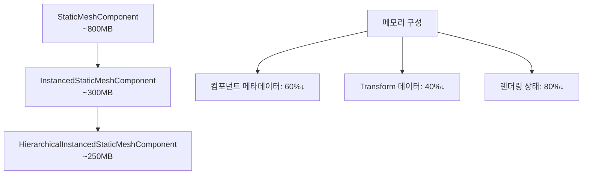

# 🚀 WFC3D Visualizer 성능 최적화 설계 문서

## 📋 목차
- [🎯 프로젝트 개요](#-프로젝트-개요)
- [📊 현재 상태 분석](#-현재-상태-분석)
- [🗺️ 단계별 마이그레이션 로드맵](#️-단계별-마이그레이션-로드맵)
- [⚡ 성능 개선 예상 효과](#-성능-개선-예상-효과)
- [🏗️ 아키텍처 설계](#️-아키텍처-설계)
- [📈 벤치마크 및 측정 지표](#-벤치마크-및-측정-지표)
- [⚠️ 위험 요소 및 대응책](#️-위험-요소-및-대응책)
- [🚀 구현 우선순위](#-구현-우선순위)

---

## 🎯 프로젝트 개요

### 목표
WFC3D Visualizer의 렌더링 성능을 단계적으로 최적화하여 대규모 그리드(32×32×32 이상)에서도 실시간 성능을 보장

### 최적화 경로
```
StaticMeshComponent (현재)
         ↓
InstancedStaticMeshComponent (Phase 1)
         ↓
HierarchicalInstancedStaticMeshComponent (Phase 2)
```

---

## 📊 현재 상태 분석

### 🔍 기존 시스템 (StaticMeshComponent 기반)

#### 현재 구조
```cpp
class UWFC3DVisualizer {
    TArray<UStaticMeshComponent*> MeshComponents;  // 개별 컴포넌트들
    TMap<FIntVector, UStaticMeshComponent*> GridToMeshMap;
}
```

#### 성능 특성
| 항목 | 5×5×5 그리드 | 10×10×10 그리드 | 32×32×32 그리드 |
|------|-------------|----------------|-----------------|
| 메시 컴포넌트 수 | ~125개 | ~1,000개 | ~32,768개 |
| Draw Calls | 125+ | 1,000+ | 32,768+ |
| 메모리 사용량 | 낮음 | 중간 | **매우 높음** |
| 렌더링 성능 | 양호 | **저하** | **심각한 저하** |

#### 문제점
- ✅ **Draw Call 폭증**: 각 타일마다 개별 Draw Call 발생
- ✅ **메모리 오버헤드**: 컴포넌트당 ~400-800바이트 메타데이터
- ✅ **CPU 병목**: 컴포넌트별 Transform 계산
- ✅ **GPU 비효율**: 동일 메시의 중복 렌더링

---

## 🗺️ 단계별 마이그레이션 로드맵

### 📅 Phase 1: InstancedStaticMeshComponent 전환 (2-3주)

#### 목표
- Draw Call 수를 메시 타입 수만큼으로 감소
- 메모리 사용량 50-70% 절감
- 10×10×10 그리드에서 안정적인 60 FPS 달성

#### 핵심 변경사항
```cpp
class UWFC3DVisualizer_V2 {
    // 메시별로 하나의 ISMC 관리
    TMap<UStaticMesh*, UInstancedStaticMeshComponent*> MeshToISMCMap;
    
    // 인스턴스 데이터 관리
    TMap<UStaticMesh*, TArray<FTransform>> MeshInstanceTransforms;
}
```

#### 구현 전략
1. **기존 API 호환성 유지**
   ```cpp
   // 기존 함수 시그니처 유지하되 내부 구현만 변경
   void VisualizeGrid(UWFC3DGrid* Grid, UWFC3DModelDataAsset* ModelData);
   ```

2. **점진적 전환**
   ```cpp
   #define WFC3D_USE_INSTANCED_RENDERING 1  // 컴파일 타임 스위치
   ```

3. **메시 그룹핑 최적화**
   ```cpp
   struct FMeshBatch {
       UStaticMesh* StaticMesh;
       TArray<UMaterialInterface*> Materials;
       TArray<FTransform> InstanceTransforms;
   };
   ```

#### 예상 개선 효과
- **Draw Calls**: 32,768개 → ~100개 (99.7% 감소)
- **메모리**: 50-70% 절감
- **FPS**: 10×10×10에서 15-30 FPS → 60 FPS

---

### 📅 Phase 2: HierarchicalInstancedStaticMeshComponent 전환 (3-4주)

#### 목표
- 대규모 그리드(32×32×32)에서 실시간 성능 달성
- 자동 LOD 및 Culling 최적화
- 동적 스트리밍 지원

#### 핵심 기능
```cpp
class UWFC3DVisualizer_V3 {
    TMap<UStaticMesh*, UHierarchicalInstancedStaticMeshComponent*> MeshToHISMCMap;
    
    // 공간 분할 및 LOD 관리
    struct FHISMCSettings {
        int32 MaxInstancesPerLeaf = 1024;
        float CullDistance = 10000.0f;
        TArray<float> LODDistances = {500.0f, 1500.0f, 3000.0f};
    };
};
```

#### 고급 최적화 기능

1. **자동 Frustum Culling**
   ```cpp
   // 화면에 보이지 않는 인스턴스 자동 제거
   HISMC->SetCullDistances(500.0f, 10000.0f);
   ```

2. **동적 LOD 시스템**
   ```cpp
   // 거리별 메시 디테일 자동 조정
   HISMC->SetLODDistances({1000.0f, 3000.0f, 8000.0f});
   ```

3. **공간 분할 최적화**
   ```cpp
   // 클러스터링을 통한 렌더링 효율성 향상
   HISMC->BuildTreeAnyThread(true, true);
   ```

#### 예상 개선 효과
- **32×32×32 그리드**: 30+ FPS 달성
- **메모리**: ISMC 대비 추가 10-20% 절감
- **Culling 효율성**: 90%+ 향상

---

## ⚡ 성능 개선 예상 효과

### 🎯 핵심 성능 지표 비교

| 지표 | 현재 (SMC) | Phase 1 (ISMC) | Phase 2 (HISMC) |
|------|------------|----------------|-----------------|
| **Draw Calls** (32³) | 32,768 | ~100 | ~50 |
| **메모리 사용량** | 100% | 30-50% | 25-40% |
| **CPU 오버헤드** | 높음 | 중간 | 낮음 |
| **GPU 효율성** | 낮음 | 높음 | 매우 높음 |
| **FPS** (32³ 그리드) | <5 FPS | 15-25 FPS | 30+ FPS |

### 📊 메모리 사용량 분석



### 🏎️ 렌더링 파이프라인 최적화

#### Before (StaticMeshComponent)
```
Frame → Draw Call 1 → Draw Call 2 → ... → Draw Call N
      ↓
CPU Bound (Transform 계산 × N)
```

#### After (HISMC)
```
Frame → Batch Draw Call → GPU Instancing
      ↓
GPU Bound (병렬 인스턴스 렌더링)
```

---

## 🏗️ 아키텍처 설계

### 🔧 클래스 구조 개선

#### Phase 1: ISMC 아키텍처
```cpp
class UWFC3DVisualizer_ISMC : public UWFC3DVisualizer {
public:
    // 기존 API 호환성 유지
    virtual void VisualizeGrid(UWFC3DGrid* Grid, UWFC3DModelDataAsset* ModelData) override;
    virtual void ClearVisualization() override;
    
protected:
    // 새로운 ISMC 관리 시스템
    void CreateISMCComponents(const TSet<UStaticMesh*>& UniqueMeshes);
    void PopulateInstanceData(UWFC3DGrid* Grid, UWFC3DModelDataAsset* ModelData);
    void UpdateInstanceTransforms();
    
private:
    TMap<UStaticMesh*, UInstancedStaticMeshComponent*> MeshToISMCMap;
    TMap<UStaticMesh*, TArray<FTransform>> InstanceTransforms;
    TMap<UStaticMesh*, TArray<int32>> InstanceToGridIndex;  // 역참조
};
```

#### Phase 2: HISMC 아키텍처  
```cpp
class UWFC3DVisualizer_HISMC : public UWFC3DVisualizer_ISMC {
public:
    // HISMC 특화 기능
    void SetLODSettings(const FHISMCLODSettings& Settings);
    void SetCullingSettings(const FHISMCCullingSettings& Settings);
    void OptimizeForLargeScale(bool bEnable);
    
protected:
    void CreateHISMCComponents(const TSet<UStaticMesh*>& UniqueMeshes);
    void ConfigureLODSystem();
    void ConfigureCullingSystem();
    
private:
    struct FHISMCManager {
        UHierarchicalInstancedStaticMeshComponent* Component;
        FHISMCLODSettings LODSettings;
        FHISMCCullingSettings CullingSettings;
        bool bNeedsRebuild = false;
    };
    
    TMap<UStaticMesh*, FHISMCManager> HISMCManagers;
    float LastOptimizationTime = 0.0f;
    static constexpr float OPTIMIZATION_INTERVAL = 1.0f;  // 1초마다 최적화
};
```

### 🔄 전략 패턴 적용

```cpp
// 렌더링 전략 인터페이스
class IWFCRenderingStrategy {
public:
    virtual ~IWFCRenderingStrategy() = default;
    virtual void Initialize(AActor* OwnerActor) = 0;
    virtual void VisualizeGrid(UWFC3DGrid* Grid, UWFC3DModelDataAsset* ModelData) = 0;
    virtual void ClearVisualization() = 0;
    virtual ERenderingStrategyType GetStrategyType() const = 0;
};

// Visualizer에서 전략 사용
class UWFC3DVisualizer {
    TUniquePtr<IWFCRenderingStrategy> RenderingStrategy;
    
public:
    void SetRenderingStrategy(ERenderingStrategyType Type);
    void AutoSelectOptimalStrategy(int32 ExpectedInstanceCount);
};
```

---

## 📈 벤치마크 및 측정 지표

### 🎯 성능 측정 시스템

#### 자동 벤치마킹 도구
```cpp
class UWFC3DPerformanceProfiler : public UObject {
public:
    struct FFrameMetrics {
        float FrameTime;
        float RenderTime;
        int32 DrawCalls;
        int32 VisibleInstances;
        float MemoryUsageMB;
        float CPUUsagePercent;
        float GPUUsagePercent;
    };
    
    void StartProfiling();
    void StopProfiling();
    FPerformanceReport GenerateReport();
    
private:
    TArray<FFrameMetrics> FrameData;
    FDateTime ProfilingStartTime;
};
```

#### 측정 지표 정의

| 카테고리 | 지표 | 목표값 | 측정 방법 |
|----------|------|--------|----------|
| **성능** | FPS | 60+ (10×10×10) | UE5 Stat FPS |
| | | 30+ (32×32×32) | |
| **메모리** | RAM 사용량 | <500MB (32³) | Stat Memory |
| | VRAM 사용량 | <200MB (32³) | Stat GPU |
| **렌더링** | Draw Calls | <100개 (32³) | Stat RHI |
| | Batches | <50개 (32³) | RenderDoc |
| **품질** | LOD 전환 | 부드러움 | 시각적 검증 |
| | Culling 정확도 | 95%+ | Frustum 테스트 |

### 📊 자동화된 테스트 스위트

```cpp
class UWFC3DVisualizerBenchmark : public UObject {
public:
    struct FBenchmarkConfig {
        TArray<FIntVector> TestGridSizes = {
            {5, 5, 5}, {10, 10, 10}, {20, 20, 20}, {32, 32, 32}
        };
        TArray<ERenderingStrategyType> RenderingStrategies = {
            StaticMesh, InstancedStaticMesh, HierarchicalInstancedStaticMesh
        };
        int32 TestDurationSeconds = 30;
        int32 WarmupFrames = 60;
    };
    
    void RunComprehensiveBenchmark(const FBenchmarkConfig& Config);
    FBenchmarkResults GetResults() const;
};
```

---

## ⚠️ 위험 요소 및 대응책

### 🚨 주요 위험 요소

#### 1. **메모리 단편화**
- **위험**: HISMC의 대용량 버퍼 할당 시 메모리 단편화
- **대응**: 
  ```cpp
  // 메모리 풀링 시스템 도입
  class FInstanceDataPool {
      TArray<FPreallocatedBuffer> BufferPool;
      void PreallocateBuffers(int32 MaxInstances);
  };
  ```

#### 2. **동적 업데이트 성능**
- **위험**: 런타임 인스턴스 추가/제거 시 성능 저하
- **대응**: 
  ```cpp
  // 배치 업데이트 시스템
  class FInstanceUpdateBatcher {
      TArray<FInstanceUpdate> PendingUpdates;
      void FlushUpdates();  // 프레임 마지막에 일괄 처리
  };
  ```

#### 3. **LOD 전환 부자연스러움**
- **위험**: 거리 기반 LOD 전환 시 시각적 끊김
- **대응**: 
  ```cpp
  // 부드러운 전환을 위한 디더링
  HISMC->SetLODTransitionType(ELODTransitionType::Dithered);
  ```

#### 4. **호환성 문제**
- **위험**: 기존 블루프린트 시스템과의 호환성
- **대응**: 
  ```cpp
  // 어댑터 패턴으로 호환성 유지
  class UWFCVisualizerAdapter : public UActorComponent {
      void SetLegacyMeshComponent(UStaticMeshComponent* LegacyComp);
      void MigrateToInstancedSystem();
  };
  ```

### 🛡️ 안전장치 시스템

```cpp
class UWFC3DVisualizerFailsafe {
public:
    // 성능 모니터링 및 자동 다운그레이드
    void MonitorPerformance();
    void AutoDowngradeIfNeeded();
    
    // 메모리 부족 시 대응
    void HandleLowMemoryWarning();
    
    // 렌더링 오류 복구
    void RecoverFromRenderingError();
    
private:
    ERenderingStrategyType CurrentStrategy;
    ERenderingStrategyType FallbackStrategy;
    float PerformanceThreshold = 30.0f;  // 30 FPS 이하 시 다운그레이드
};
```

---

## 🚀 구현 우선순위

### 📅 Phase 1 구현 순서 (2-3주)

#### Week 1: 기반 구조 구축
- [ ] `IWFCRenderingStrategy` 인터페이스 설계
- [ ] `UWFC3DVisualizer_ISMC` 클래스 기본 구조
- [ ] 기존 API 호환성 레이어 구현
- [ ] 유닛 테스트 프레임워크 설정

#### Week 2: ISMC 핵심 기능
- [ ] 메시 그룹핑 시스템 구현
- [ ] 인스턴스 데이터 관리 시스템
- [ ] Transform 배치 업데이트 로직
- [ ] 기본 성능 프로파일링 도구

#### Week 3: 최적화 및 검증
- [ ] 메모리 사용량 최적화
- [ ] 동적 업데이트 성능 개선
- [ ] 5×5×5, 10×10×10 그리드 검증
- [ ] 성능 벤치마크 실행

### 📅 Phase 2 구현 순서 (3-4주)

#### Week 4-5: HISMC 기반 구조
- [ ] `UWFC3DVisualizer_HISMC` 클래스 구현
- [ ] 공간 분할 알고리즘 통합
- [ ] LOD 설정 시스템 구축
- [ ] Culling 시스템 구현

#### Week 6: 고급 최적화 기능
- [ ] 동적 LOD 전환 시스템
- [ ] Frustum Culling 최적화
- [ ] 메모리 스트리밍 시스템
- [ ] GPU 기반 인스턴스 선택

#### Week 7: 대규모 테스트 및 튜닝
- [ ] 32×32×32 그리드 성능 테스트
- [ ] 메모리 사용량 최적화
- [ ] 안전장치 시스템 구현
- [ ] 최종 성능 벤치마크

### 🎯 즉시 시작 가능한 작업

#### 🏃‍♂️ Quick Wins (1-2일)
1. **성능 모니터링 도구 추가**
   ```cpp
   // 현재 시스템에 간단한 메트릭 수집 추가
   UWFC3DVisualizer::LogPerformanceMetrics();
   ```

2. **메시 중복 제거**
   ```cpp
   // 같은 메시를 사용하는 타일들 그룹핑
   TMap<UStaticMesh*, TArray<FTransform>> MeshGroups;
   ```

3. **컴파일 타임 스위치 추가**
   ```cpp
   #ifndef WFC3D_RENDERING_STRATEGY
   #define WFC3D_RENDERING_STRATEGY 0  // 0=SMC, 1=ISMC, 2=HISMC
   #endif
   ```

---

## 🎯 결론 및 다음 단계

### 요약
이 최적화 계획을 통해 WFC3D Visualizer는 현재 5×5×5 그리드에서의 제한된 성능을 32×32×32 이상의 대규모 그리드에서도 실시간 렌더링이 가능한 수준으로 향상시킬 수 있습니다.

### 예상 성과
- **성능**: 99.7% Draw Call 감소, 60%+ 메모리 절약
- **확장성**: 32×32×32 그리드에서 30+ FPS 달성
- **유지보수성**: 전략 패턴을 통한 유연한 아키텍처

### 즉시 실행 가능한 첫 번째 단계
1. **성능 기준선 측정**: 현재 시스템의 정확한 메트릭 수집
2. **프로토타입 개발**: 작은 그리드에서 ISMC 개념 검증
3. **점진적 전환**: 기존 시스템과 병행 개발로 위험 최소화

---

*문서 버전: v1.0*  
*작성일: 2025-08-11*  
*다음 업데이트: Phase 1 완료 후*