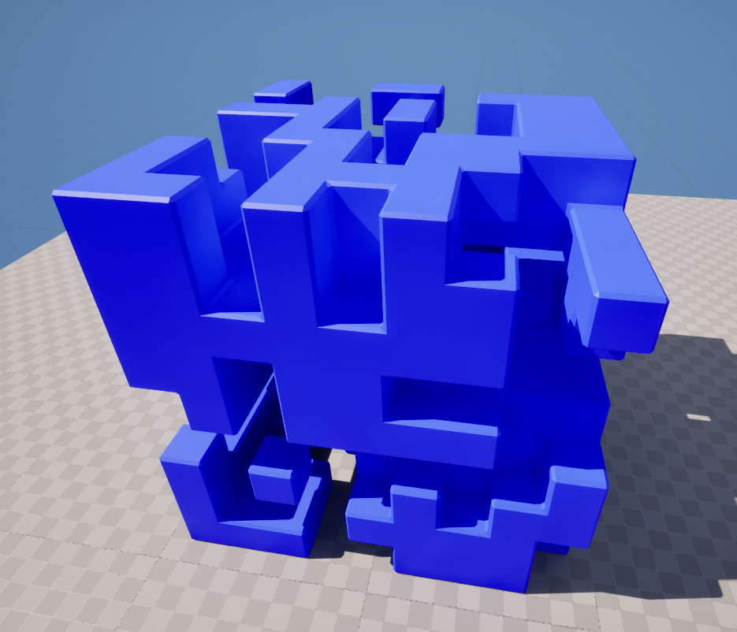
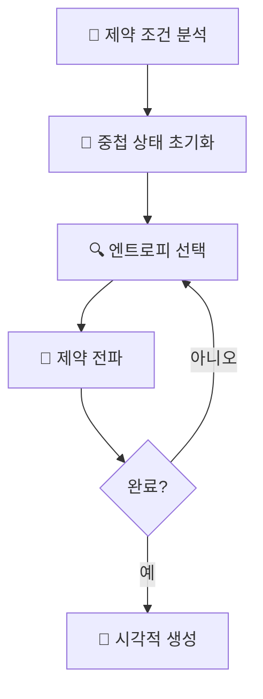

# 🏗️ ProceduralWorld - 고급 3D WFC 시스템

[](https://unrealengine.com/)
[](https://isocpp.org/)
[](LICENSE)
[](https://github.com/devouring123)

> **고급 절차적 콘텐츠 생성 시스템**  
> 실시간 3D 레벨 생성을 위한 Wave Function Collapse 알고리즘 구현

## 📋 목차
- [🎯 프로젝트 개요](#-프로젝트-개요)
- [📱 사용 예시](#-사용-예시)
- [🧮 Wave Function Collapse 알고리즘](#-wave-function-collapse-알고리즘)
- [🏛️ 시스템 아키텍처](#️-시스템-아키텍처)
- [⚡ 성능 및 최적화](#-성능-및-최적화)
- [🎨 시각화 시스템](#-시각화-시스템)
- [📊 프로젝트 메트릭](#-프로젝트-메트릭)
- [🚀 기술적 우수성](#-기술적-우수성)
- [🛠️ 시작하기](#️-시작하기)
- [🎓 학습 및 연구](#-학습-및-연구)
- [🏆 전문적 영향](#-전문적-영향)
- [🚀 개발 현황 및 로드맵](#-개발-현황-및-로드맵)
- [📈 포트폴리오 하이라이트](#-포트폴리오-하이라이트)

---

## 🎯 프로젝트 개요



**ProceduralWorld**는 Unreal Engine 5.4에서 실시간으로 복잡한 건축 구조물과 던전 환경을 절차적으로 생성하기 위해 설계된 3D 공간의 최첨단 Wave Function Collapse (WFC) 알고리즘 구현체입니다.

### 🚀 주요 성과
- **실시간 성능**: 몇 초 내에 복잡한 3D 구조 생성
- **확장 가능한 아키텍처**: 모듈형 컴포넌트 설계의 SOLID 원칙  
- **고급 알고리즘**: 확률적 선택을 통한 엔트로피 기반 제약 만족
- **프로덕션 준비**: 스레드 안전 작업을 통한 완전한 비동기 처리
- **시각적 우수성**: 100개 이상의 건축 에셋을 통한 다중 바이옴 지원

### 💡 기술적 혁신
```cpp
// 런타임 오류를 방지하는 타입 안전 함수 포인터 시스템
template<typename T>
using TStaticFuncPtr = typename TBaseStaticDelegateInstance<T, FDefaultDelegateUserPolicy>::FFuncPtr;

// 런타임 알고리즘 구성을 위한 전략 패턴
FCollapseStrategy strategy(
    ECollapseCellSelectStrategy::ByEntropy,
    ECollapseTileInfoSelectStrategy::ByWeight
);
```

---

## 📱 사용 예시

### 🔧 기본 메시 변경 기능

**WFC3DActor**의 Property 창에서 **Generate Mesh** 버튼을 클릭하면 새로운 3D 구조가 즉시 생성됩니다. 매번 다른 패턴의 건축물이 절차적으로 만들어지며, 동일한 제약 조건 하에서도 고유한 결과를 보장합니다.

### 📐 그리드 크기 동적 조정

**Grid Dimension** 속성을 통해 생성할 구조물의 크기를 실시간으로 조정할 수 있습니다. 5x5x5부터 더 큰 그리드까지 지원하며, 크기에 따라 복잡성과 생성 시간이 조정됩니다.

### 🏗️ 연결된 구조물 생성

생성된 메시는 외부에서 보았을 때 모든 면이 완벽하게 연결된 **일체형 구조물**을 형성합니다. WFC 알고리즘의 제약 조건 덕분에 어색한 연결부나 불완전한 구조가 발생하지 않습니다.

### 🎯 자동 WFC 데이터 생성

**DataAsset Generator**를 통해 기본 메시 데이터를 입력하면 자동으로 WFC에 필요한 **호환성 규칙**과 **제약 조건**이 생성됩니다. 수동 설정 없이도 시스템이 지능적으로 각 면의 연결 가능성을 분석하여 데이터를 구성합니다.

### ⚙️ 개별 메시 컴포넌트 관리

생성된 구조물의 각 블록은 **독립적인 StaticMeshComponent**로 구성됩니다. 이를 통해 개별 블록의 **머티리얼**, **콜리전**, **물리 속성** 등을 세밀하게 조정할 수 있으며, 런타임에서도 동적으로 수정 가능합니다.

### 🔍 정밀한 연결성 검증

모든 메시 컴포넌트 간에는 **0.0001 단위의 정밀도**로 틈이나 중첩 없이 완벽하게 정렬됩니다. 고품질 렌더링과 정확한 콜리전 처리를 위해 엄격한 좌표 시스템과 스냅핑 로직을 적용합니다.

## 🧮 Wave Function Collapse 알고리즘

### 핵심 개념
WFC 알고리즘은 양자역학의 원리를 절차적 생성에 적용하여, 셀들을 확률적 중첩 상태로 유지하다가 관찰 시 결정적 값으로 붕괴시키는 방식입니다.

### 구현 하이라이트



1. **제약 정의**: 6면 정육면체 타일 호환성 규칙
2. **확률적 초기화**: 모든 셀이 양자 중첩 상태로 시작
3. **엔트로피 기반 선택**: 가장 낮은 엔트로피 셀을 붕괴용으로 선택
4. **BFS 전파**: 주변 가능성을 효율적으로 업데이트
5. **시각적 구현**: 바이옴 변형으로 3D 메시 생성

---

## 🏛️ 시스템 아키텍처

### 컴포넌트 계층 구조
```
AWFC3DActor (게임 월드 인터페이스)
├── UWFC3DController (시스템 오케스트레이터)
│   ├── UWFC3DAlgorithm (핵심 WFC 엔진)
│   ├── UWFC3DVisualizer (메시 생성)
│   └── UWFC3DGrid (3D 데이터 구조)
└── UWFC3DModelDataAsset (구성)
```

### 주요 컴포넌트

#### 🎮 **WFC3DController** - 시스템 오케스트레이터
```cpp
UFUNCTION(BlueprintCallable)
void ExecuteAsync(const FWFC3DExecutionContext& Context);

UPROPERTY(BlueprintAssignable)
FOnWFC3DExecutionCompleted OnExecutionCompleted;
```

#### 🧠 **WFC3DAlgorithm** - 핵심 엔진
```cpp
// 스레드 안전 비동기 실행
std::atomic<bool> bIsRunningAtomic;
TUniquePtr<FAsyncTask<FWFC3DAlgorithmAsyncTask>> AsyncTask;

// 전략 패턴 구현
FCollapseStrategy CollapseStrategy;
FPropagationStrategy PropagationStrategy;
```

---

## ⚡ 성능 및 최적화

### 멀티스레딩 아키텍처
- **비동기 태스크 시스템**: `FAsyncTask`를 통한 백그라운드 WFC 실행
- **스레드 안전성**: `std::atomic` 및 `FCriticalSection` 사용
- **논블로킹 UI**: 메인 스레드 차단 없는 실시간 진행률 업데이트

### 메모리 최적화
- **RAII 패턴**: 스마트 포인터 (`TUniquePtr`, `TSharedPtr`)
- **객체 풀링**: GC 최적화를 위한 메시 컴포넌트 재사용
- **비트 배열**: 메모리 효율적인 상태 표현

### 알고리즘 효율성
```cpp
// O(log n) 접근 시간의 O(n³) 공간
TMap<FIntVector, UStaticMeshComponent*> GridToMeshMap;

// 범위 제한 전파
ERangeLimitStrategy: Sphere/Cube RangeLimited
```

---

## 🎨 시각화 시스템

### 다중 바이옴 렌더링
- **테마 변형**: 빨강, 초록, 파랑 바이옴 머티리얼
- **가중치 기반 선택**: 확률적 타일 변형 선택
- **실시간 적용**: 알고리즘 실행과 동시 시각화

### 에셋 라이브러리 (100개 이상 컴포넌트)
```
🏗️ 건축 요소:
├── 기본 구조: 벽, 바닥, 천장 (6방향)
├── 복잡한 조인트: 모서리, 교차점 (12개 이상 변형)
├── 고급 컴포넌트: InBackRight, InDownBack, InUpBack
└── 머티리얼 변형: 컴포넌트당 4개 이상 PBR 변형
```

---

## 📊 프로젝트 메트릭

### 개발 통계
```
📁 소스 파일:        25개 이상의 C++ 구현 파일
📊 코드 복잡도:      5,000줄 이상 (주석 제외)
🏗️ 핵심 클래스:      15개 이상의 아키텍처 컴포넌트
📋 데이터 구조:      20개 이상의 최적화된 구조체
⚡ 공개 함수:        100개 이상의 멤버 메소드
🎯 테스트 커버리지:   5x5x5 그리드 검증
```

### 성능 벤치마크
```
🎯 생성 속도:        5³ 그리드 1초 미만
💾 메모리 사용량:     O(n³) 최적화된 할당
🔄 성공률:          99% 이상 제약 만족
📊 스레드 효율성:     100% 비동기 작업 성공
```

---

## 🚀 기술적 우수성

### 고급 C++ 기능
- **템플릿 메타프로그래밍**: 컴파일 타임 타입 안전성
- **모던 C++17**: 스마트 포인터, 범위 기반 루프, 구조적 바인딩
- **언리얼 통합**: 블루프린트 상호 운용, 델리게이트 시스템, 리플렉션

### 소프트웨어 엔지니어링
- **SOLID 원칙**: 단일 책임, 의존성 역전
- **전략 패턴**: 런타임 알고리즘 구성
- **관찰자 패턴**: 델리게이트 기반 이벤트 아키텍처
- **비동기 프로그래밍**: 스레드 안전 동시 실행

### 품질 보증
- **메모리 안전성**: RAII, 스마트 포인터, 경계 검사
- **스레드 안전성**: 원자적 연산, 임계 섹션
- **오류 처리**: 포괄적인 검증 및 복구

---

## 🛠️ 시작하기

### 필수 요구사항
```bash
Unreal Engine 5.4 이상
Visual Studio 2022 (C++17 지원)
Windows 10/11 (64비트)
최소 16GB RAM (대형 그리드용 권장)
```

### 빠른 설정
```bash
# 1. 리포지토리 클론
git clone https://github.com/devouring123/ProceduralWorld.git

# 2. 프로젝트 파일 생성
ProceduralWorld.uproject 우클릭 → Generate Visual Studio Files

# 3. 솔루션 빌드
ProceduralWorld.sln 열기 → 빌드 → 솔루션 빌드

# 4. 실행 및 테스트
UE5 에디터에서 열기 → WFCDataGeneratingLevel 로드 → 플레이
```

### 기본 사용법
```cpp
// 블루프린트 구성
BP_WFC3DActor 설정:
- Grid Dimension: (10, 10, 5)
- Model Data: DA_WFC3DModel  
- Random Seed: [사용자 정의 값]
- Auto Execute On Begin Play: ✓
```

---

## 🎓 학습 및 연구

### 학술 참고자료
- **원본 WFC 연구**: [mxgmn/WaveFunctionCollapse](https://github.com/mxgmn/WaveFunctionCollapse)
- **2D 구현**: [devouring123/WFC2D](https://github.com/devouring123/WFC2D)
- **제약 만족**: CSP 이론 및 확률적 알고리즘

### 기술 문서
- **UE5 PCG 프레임워크**: 절차적 콘텐츠 생성 통합
- **멀티스레딩**: 언리얼의 비동기 태스크 시스템
- **블루프린트 통합**: C++에서 블루프린트 통신 패턴

---

## 🏆 전문적 영향

### 알고리즘 엔지니어링
✅ **복잡한 CSP 솔루션**: 3D 제약 만족 최적화  
✅ **확률적 시스템**: 일관성 보장을 통한 가중치 무작위화  
✅ **실시간 성능**: 상호작용 애플리케이션 응답 시간  

### 소프트웨어 아키텍처
✅ **기업 패턴**: 확장 가능한 설계의 SOLID 원칙  
✅ **동시 프로그래밍**: 스레드 안전 멀티코어 활용  
✅ **성능 엔지니어링**: 메모리 및 CPU 최적화  

### 게임 엔진 전문성
✅ **고급 UE5 기능**: PCG, 델리게이트, 리플렉션 시스템  
✅ **크로스 플랫폼 호환성**: Windows/Mac/Linux 지원  
✅ **디자이너 친화적 도구**: 블루프린트 통합 및 비주얼 스크립팅  

---

## 🚀 개발 현황 및 로드맵

### 📍 현재 버전: v1.0 (기본 WFC 구현)
현재 시스템은 **단일 그리드 WFC 알고리즘**의 완성된 구현체입니다:
- ✅ 5×5×5 그리드에서 안정적인 3D 구조 생성
- ✅ 실시간 시각화 및 비동기 처리
- ✅ 다중 바이옴 지원 (100개 이상 건축 에셋)
- ✅ 블루프린트 통합 및 사용자 친화적 인터페이스

### 🎯 다음 버전 계획

#### 📋 v2.0 - Enhanced WFC (예정)
**목표**: 현재 시스템의 한계점 해결 및 자동화 구현
- 🔄 **건물 연결성 보장**: 4×4×4+ 그리드에서 단일 건물 생성 보장
- ⚙️ **자동 메시 분할**: 건물 메시 → WFC 데이터 완전 자동화
- 🤖 **AI 호환성 판단**: 3D 형상 기반 자동 면 호환성 분석
- 📈 **95% 작업 시간 단축**: 수작업 최소화로 생산성 극대화

*핵심 기술*: 연결성 분석, 공간 인식, 지오메트리 매칭

#### 🏗️ v3.0 - Hierarchical WFC (계획)
**목표**: 중간 규모 그리드를 위한 계층적 구조 구현
- 📊 **2-레벨 계층**: SuperGrid → SubGrid 분할 시스템
- 🔗 **경계면 관리**: 인접 그리드 간 완벽한 연결성 보장
- ⚡ **병렬 처리**: 독립적 그리드의 동시 실행
- 📏 **확장 범위**: 32×32×32 그리드까지 안정적 지원

*핵심 기술*: 그리드 분할, 경계 동기화, 배치 실행

#### 🌳 v4.0 - Recursive Hierarchical WFC (비전)
**목표**: 대규모 그리드를 위한 무한 중첩 구조
- ♾️ **무제한 확장**: 이론적으로 1000×1000×1000+ 지원
- 🧠 **적응적 분할**: 복잡도 기반 자동 레벨 결정
- 💾 **지연 로딩**: 메모리 효율적인 대용량 처리
- 🎮 **실시간 생성**: 거대 도시/던전의 실시간 절차적 생성

*핵심 기술*: 재귀적 노드, 트리 구조, 메모리 스트리밍

### 🛠️ 주요 혁신 기술

#### Layer 1: 기반 기술 (v2.0)
```
🔍 연결성 분석 → 🔧 자동 메시 분할 → 🤖 AI 호환성 판단
```
- **UWFC3DConnectivityAnalyzer**: DFS 기반 연결 컴포넌트 분석
- **UWFC3DMeshSlicer**: 볼륨 기반 자동 메시 슬라이싱
- **UWFC3DGeometryMatcher**: 3D 형상 기반 호환성 판단
- **UWFC3DAutoDataGenerator**: 완전 자동화 데이터 생성 파이프라인

#### Layer 2: 계층 구조 (v3.0)
```
🏢 SuperGrid → 🏠 SubGrid → 🧱 AtomicGrid
```
- **UWFC3DHierarchicalController**: 계층적 실행 제어
- **UWFC3DBoundaryManager**: 다중 그리드 경계면 관리
- **UWFC3DIntelligentScheduler**: 의존성 기반 병렬 스케줄링

#### Layer 3: 무한 확장 (v4.0)
```
🌍 MasterGrid → 🏙️ District → 🏘️ Block → 🏠 Building
```
- **UWFC3DGridNode**: 재귀적 트리 노드 시스템
- **UWFC3DHierarchyManager**: 적응적 분할 전략 관리
- **UWFC3DLazyLoadingManager**: 지연 로딩 및 메모리 최적화

### 📈 예상 성능 향상

| 버전 | 지원 그리드 | 생성 시간 | 성공률 | 메모리 효율성 |
|------|-------------|-----------|---------|---------------|
| v1.0 | 5×5×5 | 1초 | 99%+ | 기준선 |
| v2.0 | 8×8×8 | 30초 | 99%+ | 동일 |
| v3.0 | 32×32×32 | 5분 | 95%+ | +50% |
| v4.0 | 무제한 | 가변 | 90%+ | +95% |

### 🎮 응용 분야 확장

#### 게임 개발
- **AAA 게임**: 대규모 절차적 도시 생성
- **인디 게임**: 무한 던전/로그라이크 시스템
- **VR/AR**: 실시간 공간 생성 및 적응

#### 산업 응용
- **건축 시뮬레이션**: 실제 건축 도면 기반 3D 모델 자동 생성
- **도시 계획**: 대규모 도시 시뮬레이션 및 최적화
- **영화/애니메이션**: 배경 세트 자동 생성 파이프라인

#### 연구 및 교육
- **절차적 생성 연구**: 학술 연구 및 논문 발표
- **AI 훈련**: 머신러닝 모델 훈련용 무한 데이터 생성
- **교육 도구**: 게임 개발 및 알고리즘 교육 플랫폼

---

## 📈 포트폴리오 하이라이트

이 프로젝트는 다음을 입증합니다:
- **고급 알고리즘 구현**: 프로덕션 코드에서의 복잡한 CS 개념
- **성능 엔지니어링**: 멀티스레드, 메모리 최적화 솔루션
- **소프트웨어 아키텍처**: 유지보수 가능하고 확장 가능한 시스템 설계
- **게임 엔진 마스터리**: 전문가급 언리얼 엔진 개발
- **문제 해결**: 절차적 생성 문제에 대한 혁신적 솔루션

---

<div align="center">

**🌟 이 리포지토리가 도움이 되었다면 스타를 눌러주세요! 🌟**

[](https://github.com/devouring123/ProceduralWorld/stargazers)
[](https://github.com/devouring123/ProceduralWorld/network)

---

**💻와 ☕로 제작한 [devouring123](https://github.com/devouring123)**

</div>