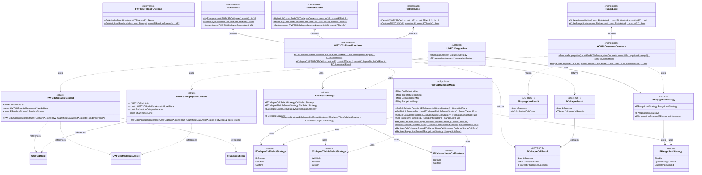

```mermaid
classDiagram
    %% 메인 알고리즘 클래스
    class UWFC3DAlgorithm {
    <<UObject>>
    +FCollapseStrategy CollapseStrategy
    +FPropagationStrategy PropagationStrategy
    }
    
    %% 컨텍스트 구조체들
    class FWFC3DCollapseContext {
    <<struct>>
    +UWFC3DGrid* Grid
    +const UWFC3DModelDataAsset* ModelData
    +const FRandomStream* RandomStream
    +FWFC3DCollapseContext(UWFC3DGrid*, const UWFC3DModelDataAsset*, const FRandomStream*)
    }
    
    class FWFC3DPropagationContext {
    <<struct>>
    +UWFC3DGrid* Grid
    +const UWFC3DModelDataAsset* ModelData
    +const FIntVector CollapseLocation
    +const int32 RangeLimit
    +FWFC3DPropagationContext(UWFC3DGrid*, const UWFC3DModelDataAsset*, const FIntVector&, const int32)
    }
    
    %% 전략 구조체들
    class FCollapseStrategy {
    <<struct>>
    +ECollapseCellSelectStrategy CellSelectStrategy
    +ECollapseTileInfoSelectStrategy TileSelectStrategy
    +ECollapseSingleCellStrategy CellCollapseStrategy
    +FCollapseStrategy()
    +FCollapseStrategy(ECollapseCellSelectStrategy, ECollapseTileInfoSelectStrategy, ECollapseSingleCellStrategy)
    }
    
    class FPropagationStrategy {
    <<struct>>
    +ERangeLimitStrategy RangeLimitStrategy
    +FPropagationStrategy()
    +FPropagationStrategy(ERangeLimitStrategy)
    }
    
    %% 결과 구조체들
    class FCollapseCellResult {
    <<USTRUCT>>
    +bool bSuccess
    +int32 CollapsedIndex
    +FIntVector CollapsedLocation
    }
    
    class FCollapseResult {
    <<USTRUCT>>
    +bool bSuccess
    +TArray<FCollapseCellResult> CollapseCellResults
    }
    
    class FPropagationResult {
    <<USTRUCT>>
    +bool bSuccess
    +int32 AffectedCellCount
    }
    
    %% 전략 열거형들
    class ECollapseCellSelectStrategy {
    <<enum>>
    ByEntropy
    Random
    Custom
        }
    
    class ECollapseTileInfoSelectStrategy {
    <<enum>>
    ByWeight
    Random
    Custom
        }
    
    class ECollapseSingleCellStrategy {
    <<enum>>
    Default
    Custom
    }
    
    class ERangeLimitStrategy {
    <<enum>>
    Disable
    SphereRangeLimited
    CubeRangeLimited
        }
    
    %% 함수 매핑 클래스
    class FWFC3DFunctionMaps {
    <<utilityclass>>
    -TMap CellSelectorMap
    -TMap TileInfoSelectorMap
    -TMap CellCollapserMap
    -TMap RangeLimitMap
    +GetCellSelectorFunction(ECollapseCellSelectStrategy) SelectCellFunc$
    +GetTileInfoSelectorFunction(ECollapseTileInfoSelectStrategy) SelectTileInfoFunc$
    +GetCellCollapserFunction(ECollapseSingleCellStrategy) CollapseSingleCellFunc$
    +GetRangeLimitFunction(ERangeLimitStrategy) RangeLimitFunc$
    +RegisterCellSelectorEnum(ECollapseCellSelectStrategy, SelectCellFunc)$
    +RegisterTileInfoSelectorEnum(ECollapseTileInfoSelectStrategy, SelectTileInfoFunc)$
    +RegisterCellCollapserEnum(ECollapseSingleCellStrategy, CollapseSingleCellFunc)$
    +RegisterRangeLimitEnum(ERangeLimitStrategy, RangeLimitFunc)$
    }
    
    %% 헬퍼 함수 클래스
    class FWFC3DHelperFunctions {
    <<utilityclass>>
    +GetAllIndexFromBitset(const TBitArray&) TArray<int32>$
    +GetWeightedRandomIndex(const TArray<float>&, const FRandomStream*) int32$
    }
    
    %% 네임스페이스 함수들
    class WFC3DCollapseFunctions {
    <<namespace>>
    +ExecuteCollapse(const FWFC3DCollapseContext&, const FCollapseStrategy&) FCollapseResult$
    +CollapseCell(FWFC3DCell*, const int32, const FTileInfo*, const CollapseSingleCellFunc) FCollapseCellResult$
    }
    
    class WFC3DPropagateFunctions {
    <<namespace>>
    +ExecutePropagation(const FWFC3DPropagationContext&, const FPropagationStrategy&) FPropagationResult$
    +PropagateCell(FWFC3DCell*, UWFC3DGrid*, TQueue<FIntVector>&, const UWFC3DModelDataAsset*) bool$
    }
    
    %% 셀 선택자 서브네임스페이스
    class CellSelector {
    <<namespace>>
    +ByEntropy(const FWFC3DCollapseContext&) int32$
    +Random(const FWFC3DCollapseContext&) int32$
    +Custom(const FWFC3DCollapseContext&) int32$
    }
    
    class TileInfoSelector {
    <<namespace>>
    +ByWeight(const FWFC3DCollapseContext&, const int32) const FTileInfo*$
    +Random(const FWFC3DCollapseContext&, const int32) const FTileInfo*$
    +Custom(const FWFC3DCollapseContext&, const int32) const FTileInfo*$
    }
    
    class CellCollapser {
    <<namespace>>
    +Default(FWFC3DCell*, const int32, const FTileInfo*) bool$
    +Custom(FWFC3DCell*, const int32, const FTileInfo*) bool$
    }
    
    class RangeLimit {
    <<namespace>>
    +SphereRangeLimited(const FIntVector&, const FIntVector&, const int32) bool$
    +CubeRangeLimited(const FIntVector&, const FIntVector&, const int32) bool$
    }
    
    %% 관계 정의
    UWFC3DAlgorithm --> FCollapseStrategy : uses
    UWFC3DAlgorithm --> FPropagationStrategy : uses
    
    FCollapseStrategy --> ECollapseCellSelectStrategy : uses
    FCollapseStrategy --> ECollapseTileInfoSelectStrategy : uses
    FCollapseStrategy --> ECollapseSingleCellStrategy : uses
    
    FPropagationStrategy --> ERangeLimitStrategy : uses
    
    FWFC3DCollapseContext ..> UWFC3DGrid : references
    FWFC3DCollapseContext ..> UWFC3DModelDataAsset : references
    FWFC3DCollapseContext ..> FRandomStream : references
    
    FWFC3DPropagationContext ..> UWFC3DGrid : references
    FWFC3DPropagationContext ..> UWFC3DModelDataAsset : references
    
    WFC3DCollapseFunctions ..> FWFC3DCollapseContext : uses
    WFC3DCollapseFunctions ..> FCollapseStrategy : uses
    WFC3DCollapseFunctions ..> FCollapseResult : returns
    WFC3DCollapseFunctions ..> FCollapseCellResult : returns
    
    WFC3DPropagateFunctions ..> FWFC3DPropagationContext : uses
    WFC3DPropagateFunctions ..> FPropagationStrategy : uses
    WFC3DPropagateFunctions ..> FPropagationResult : returns
    
    FWFC3DFunctionMaps ..> ECollapseCellSelectStrategy : uses
    FWFC3DFunctionMaps ..> ECollapseTileInfoSelectStrategy : uses
    FWFC3DFunctionMaps ..> ECollapseSingleCellStrategy : uses
    FWFC3DFunctionMaps ..> ERangeLimitStrategy : uses
    
    CellSelector <-- WFC3DCollapseFunctions : contains
    TileInfoSelector <-- WFC3DCollapseFunctions : contains
    CellCollapser <-- WFC3DCollapseFunctions : contains
    RangeLimit <-- WFC3DPropagateFunctions : contains
    
    FCollapseResult --> FCollapseCellResult : contains
```