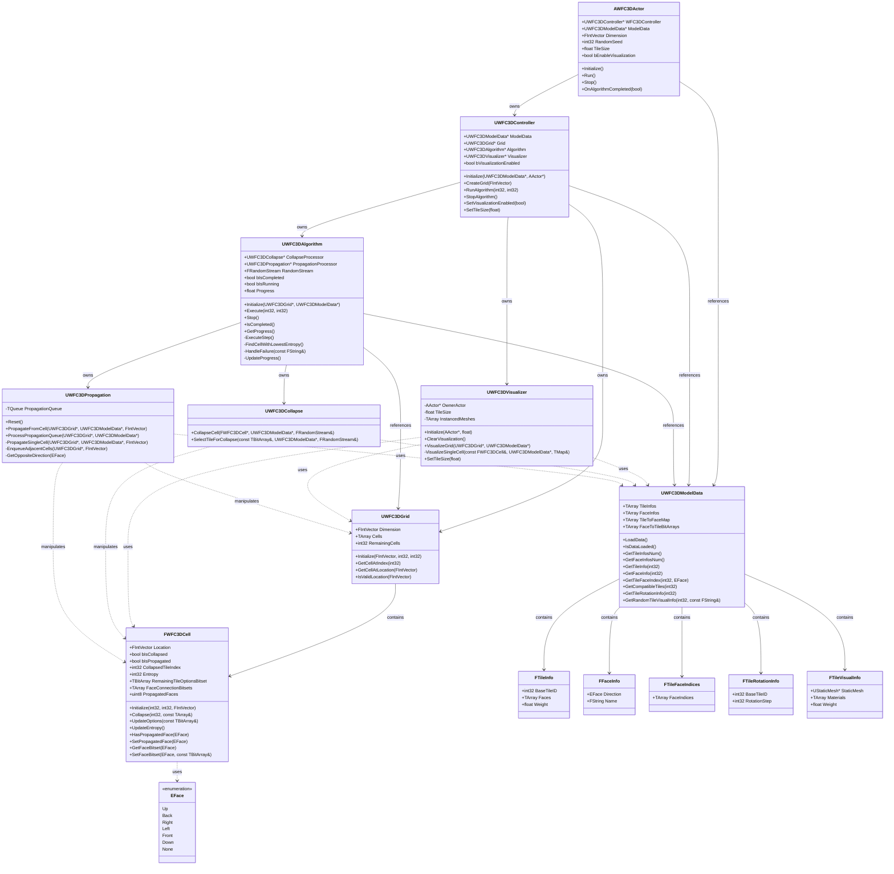

```mermaid
classDiagram
%% 액터 및 컨트롤러
    class AWFC3DActor {
        +UWFC3DController* WFC3DController
        +UWFC3DModelData* ModelData
        +FIntVector Dimension
        +int32 RandomSeed
        +float TileSize
        +bool bEnableVisualization
        +Initialize()
        +Run()
        +Stop()
        +OnAlgorithmCompleted(bool)
    }

    class UWFC3DController {
        +UWFC3DModelData* ModelData
        +UWFC3DGrid* Grid
        +UWFC3DAlgorithm* Algorithm
        +UWFC3DVisualizer* Visualizer
        +bool bVisualizationEnabled
        +Initialize(UWFC3DModelData*, AActor*)
        +CreateGrid(FIntVector)
        +RunAlgorithm(int32, int32)
        +StopAlgorithm()
        +SetVisualizationEnabled(bool)
        +SetTileSize(float)
    }

%% 데이터 모델
    class UWFC3DModelData {
        +TArray<FTileInfo> TileInfos
        +TArray<FFaceInfo> FaceInfos
        +TArray<FTileFaceIndices> TileToFaceMap
        +TArray<TBitArray> FaceToTileBitArrays
        +LoadData()
        +IsDataLoaded()
        +GetTileInfosNum()
        +GetFaceInfosNum()
        +GetTileInfo(int32)
        +GetFaceInfo(int32)
        +GetTileFaceIndex(int32, EFace)
        +GetCompatibleTiles(int32)
        +GetTileRotationInfo(int32)
        +GetRandomTileVisualInfo(int32, const FString&)
    }

    class UWFC3DGrid {
        +FIntVector Dimension
        +TArray<FWFC3DCell> Cells
        +int32 RemainingCells
        +Initialize(FIntVector, int32, int32)
        +GetCellAtIndex(int32)
        +GetCellAtLocation(FIntVector)
        +IsValidLocation(FIntVector)
    }

    class FWFC3DCell {
        +FIntVector Location
        +bool bIsCollapsed
        +bool bIsPropagated
        +int32 CollapsedTileIndex
        +int32 Entropy
        +TBitArray RemainingTileOptionsBitset
        +TArray<TBitArray> FaceConnectionBitsets
        +uint8 PropagatedFaces
        +Initialize(int32, int32, FIntVector)
        +Collapse(int32, const TArray<TBitArray>&)
        +UpdateOptions(const TBitArray&)
        +UpdateEntropy()
        +HasPropagatedFace(EFace)
        +SetPropagatedFace(EFace)
        +GetFaceBitset(EFace)
        +SetFaceBitset(EFace, const TBitArray&)
    }

    class EFace {
        <<enumeration>>
        Up
        Back
        Right
        Left
        Front
        Down
        None
    }

%% 알고리즘
    class UWFC3DAlgorithm {
        +UWFC3DCollapse* CollapseProcessor
        +UWFC3DPropagation* PropagationProcessor
        +FRandomStream RandomStream
        +bool bIsCompleted
        +bool bIsRunning
        +float Progress
        +Initialize(UWFC3DGrid*, UWFC3DModelData*)
        +Execute(int32, int32)
        +Stop()
        +IsCompleted()
        +GetProgress()
        -ExecuteStep()
        -FindCellWithLowestEntropy()
        -HandleFailure(const FString&)
        -UpdateProgress()
    }

    class UWFC3DCollapse {
        +CollapseCell(FWFC3DCell*, UWFC3DModelData*, FRandomStream&)
        +SelectTileForCollapse(const TBitArray&, UWFC3DModelData*, FRandomStream&)
    }

    class UWFC3DPropagation {
        -TQueue<FIntVector> PropagationQueue
        +Reset()
        +PropagateFromCell(UWFC3DGrid*, UWFC3DModelData*, FIntVector)
        +ProcessPropagationQueue(UWFC3DGrid*, UWFC3DModelData*)
        -PropagateSingleCell(UWFC3DGrid*, UWFC3DModelData*, FIntVector)
        -EnqueueAdjacentCells(UWFC3DGrid*, FIntVector)
        -GetOppositeDirection(EFace)
    }

%% 시각화
    class UWFC3DVisualizer {
        -AActor* OwnerActor
        -float TileSize
        -TArray<UInstancedStaticMeshComponent*> InstancedMeshes
        +Initialize(AActor*, float)
        +ClearVisualization()
        +VisualizeGrid(UWFC3DGrid*, UWFC3DModelData*)
        -VisualizeSingleCell(const FWFC3DCell&, UWFC3DModelData*, TMap<UStaticMesh*, UInstancedStaticMeshComponent*>&)
        +SetTileSize(float)
    }

%% 타입 정의
    class FTileInfo {
        +int32 BaseTileID
        +TArray<int32> Faces
        +float Weight
    }

    class FFaceInfo {
        +EFace Direction
        +FString Name
    }

    class FTileFaceIndices {
        +TArray<int32> FaceIndices
    }

    class FTileRotationInfo {
        +int32 BaseTileID
        +int32 RotationStep
    }

    class FTileVisualInfo {
        +UStaticMesh* StaticMesh
        +TArray<UMaterialInterface*> Materials
        +float Weight
    }

%% 관계 정의
    AWFC3DActor --> UWFC3DController : owns
    AWFC3DActor --> UWFC3DModelData : references

    UWFC3DController --> UWFC3DModelData : references
    UWFC3DController --> UWFC3DGrid : owns
    UWFC3DController --> UWFC3DAlgorithm : owns
    UWFC3DController --> UWFC3DVisualizer : owns

    UWFC3DAlgorithm --> UWFC3DCollapse : owns
    UWFC3DAlgorithm --> UWFC3DPropagation : owns
    UWFC3DAlgorithm --> UWFC3DGrid : references
    UWFC3DAlgorithm --> UWFC3DModelData : references

    UWFC3DGrid --> FWFC3DCell : contains

    UWFC3DVisualizer ..> UWFC3DGrid : uses
    UWFC3DVisualizer ..> UWFC3DModelData : uses
    UWFC3DVisualizer ..> FWFC3DCell : uses

    UWFC3DCollapse ..> FWFC3DCell : manipulates
    UWFC3DCollapse ..> UWFC3DModelData : uses

    UWFC3DPropagation ..> UWFC3DGrid : manipulates
    UWFC3DPropagation ..> FWFC3DCell : manipulates
    UWFC3DPropagation ..> UWFC3DModelData : uses

    FWFC3DCell ..> EFace : uses

    UWFC3DModelData --> FTileInfo : contains
    UWFC3DModelData --> FFaceInfo : contains
    UWFC3DModelData --> FTileFaceIndices : contains
    UWFC3DModelData --> FTileRotationInfo : contains
    UWFC3DModelData --> FTileVisualInfo : contains
```