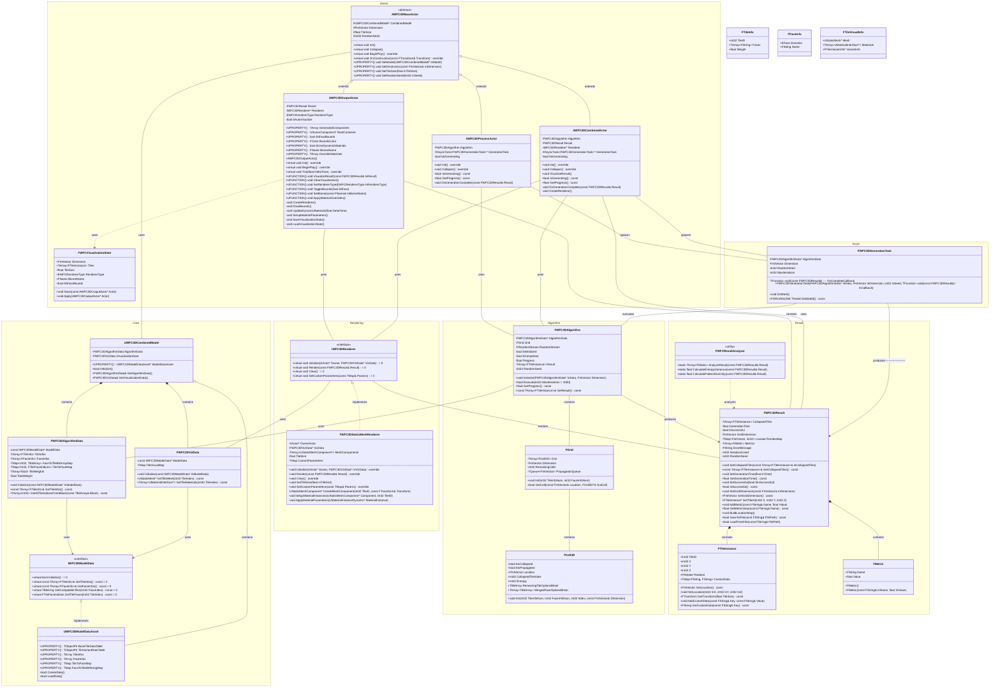

```mermaid
classDiagram
%% 핵심 데이터 및 모델 클래스들
    namespace Core {
        class IWFC3DModelData {
            <<interface>>
            +virtual bool Initialize() = 0
            +virtual const TArray~FTileInfo~& GetTileInfos() const = 0
            +virtual const TArray~FFaceInfo~& GetFaceInfos() const = 0
            +virtual TBitArray GetCompatibleTiles(int32 FaceIndex) const = 0
            +virtual FTileFaceIndices GetTileFaces(int32 TileIndex) const = 0
        }

        class UWFC3DModelDataAsset {
            +UPROPERTY() TObjectPtr<UDataTable> BaseTileDataTable
            +UPROPERTY() TObjectPtr<UDataTable> TileVariantDataTable
            +UPROPERTY() TArray<FBaseTileInfo> TileInfos
            +UPROPERTY() TArray<FFacePair> FaceInfos
            +UPROPERTY() TMap<int32, FTileFaceIndices> TileToFaceMap
            +UPROPERTY() TMap<int32, FTileBitString> FaceToTileBitStringMap
            +bool CreateData()
            +bool LoadData()
        }

        class FWFC3DAlgorithmData {
            -const IWFC3DModelData* ModelData
            -TArray~FTileInfo~ TileInfos
            -TArray~FFaceInfo~ FaceInfos
            -TMap~int32, TBitArray~ FaceToTileBitArrayMap
            -TMap~int32, FTileFaceIndices~ TileToFaceMap
            -TArray~float~ TileWeights
            -float TotalWeight
            +void Initialize(const IWFC3DModelData* InModelData)
            +const TArray~FTileInfo~& GetTileInfos() const
            +TArray~int32~ GetAllTileIndicesFromBitset(const TBitArray& Bitset) const
        }

        class FWFC3DVizData {
            -const IWFC3DModelData* ModelData
            -TMap<int32, FTileVisualInfo> TileVisualMap
            +void Initialize(const IWFC3DModelData* InModelData)
            +UStaticMesh* GetTileMesh(int32 TileIndex) const
            +TArray~UMaterialInterface*~ GetTileMaterials(int32 TileIndex) const
        }

        class UWFC3DCombinedModel {
            +UPROPERTY() UWFC3DModelDataAsset* ModelDataAsset
            -FWFC3DAlgorithmData AlgorithmData
            -FWFC3DVizData VisualizationData
            +bool Initialize()
            +FWFC3DAlgorithmData& GetAlgorithmData()
            +FWFC3DVizData& GetVisualizationData()
        }
    }

%% 알고리즘 관련 클래스들
    namespace Algorithm {
        class FWFC3DAlgorithm {
            -FWFC3DAlgorithmData* AlgorithmData
            -FGrid Grid
            -FRandomStream RandomStream
            -bool bInitialized
            -bool bCompleted
            -float Progress
            -TArray~FTileInstance~ Result
            -int32 RandomSeed
            +void Initialize(FWFC3DAlgorithmData* InData, FIntVector Dimension)
            +bool Execute(int32 MaxIterations = 1000)
            +float GetProgress() const
            +const TArray~FTileInstance~& GetResult() const
        }

        class FGrid {
            -TArray~FCell3D~ Grid
            -FIntVector Dimension
            -int32 RemainingCells
            -TQueue~FIntVector~ PropagationQueue
            +void Init(int32 TileInfoNum, int32 FaceInfoNum)
            +bool GetCell(const FIntVector& Location, FCell3D*& OutCell)
        }

        class FCell3D {
            +bool bIsCollapsed
            +bool bIsPropagated
            +FIntVector Location
            +int32 CollapsedTileIndex
            +int32 Entropy
            +TBitArray RemainingTileOptionsBitset
            +TArray~TBitArray~ MergedFaceOptionsBitset
            +void Init(int32 TileInfoNum, int32 FaceInfoNum, int32 Index, const FIntVector& Dimension)
        }
    }

%% 결과 관련 클래스들
    namespace Result {
        class FWFC3DResult {
            -TArray~FTileInstance~ CollapsedTiles
            -float GenerationTime
            -bool bSuccessful
            -FIntVector GridDimension
            -TMap~FIntVector, int32~ LocationToIndexMap
            -TArray~FMetric~ Metrics
            -FString ErrorMessage
            -int32 IterationsUsed
            -int32 RandomSeed
            +void SetCollapsedTiles(const TArray~FTileInstance~& InCollapsedTiles)
            +const TArray~FTileInstance~& GetCollapsedTiles() const
            +void SetGenerationTime(float InTime)
            +float GetGenerationTime() const
            +void SetSuccessful(bool bInSuccessful)
            +bool IsSuccessful() const
            +void SetGridDimension(const FIntVector& InDimension)
            +FIntVector GetGridDimension() const
            +FTileInstance* GetTileAt(int32 X, int32 Y, int32 Z)
            +void AddMetric(const FString& Name, float Value)
            +float GetMetricValue(const FString& Name) const
            +void BuildLocationMap()
            +bool SaveToFile(const FString& FilePath) const
            +bool LoadFromFile(const FString& FilePath)
        }

        class FTileInstance {
            +int32 TileID
            +int32 X
            +int32 Y
            +int32 Z
            +FRotator Rotation
            +TMap~FString, FString~ CustomData
            +FIntVector GetLocation() const
            +void SetLocation(int32 InX, int32 InY, int32 InZ)
            +FTransform GetTransform(float TileSize) const
            +void AddCustomData(const FString& Key, const FString& Value)
            +FString GetCustomData(const FString& Key) const
        }

        class FMetric {
            +FString Name
            +float Value
            +FMetric()
            +FMetric(const FString& InName, float InValue)
        }

        class FWFCResultAnalyzer {
            <<utility>>
            +static TArray~FMetric~ AnalyzeResult(const FWFC3DResult& Result)
            +static float CalculateEntropyVariance(const FWFC3DResult& Result)
            +static float CalculatePatternDiversity(const FWFC3DResult& Result)
        }
    }

%% 렌더링 관련 클래스들
    namespace Rendering {
        class IWFC3DRenderer {
            <<interface>>
            +virtual void Initialize(AActor* Owner, FWFC3DVizData* VizData) = 0
            +virtual void Render(const FWFC3DResult& Result) = 0
            +virtual void Clear() = 0
            +virtual void SetCustomParameters(const TMap<FName, float>& Params) = 0
        }

        class FWFC3DStaticMeshRenderer {
            -AActor* OwnerActor
            -FWFC3DVizData* VizData
            -TArray~UStaticMeshComponent*~ MeshComponents
            -float TileSize
            -TMap<FName, float> CustomParameters
            +void Initialize(AActor* Owner, FWFC3DVizData* InVizData) override
            +void Render(const FWFC3DResult& Result) override
            +void Clear() override
            +void SetTileSize(float InTileSize)
            +void SetCustomParameters(const TMap<FName, float>& Params) override
            -UStaticMeshComponent* CreateMeshComponent(int32 TileID, const FTransform& Transform)
            -void SetupMaterialInstances(UStaticMeshComponent* Component, int32 TileID)
            -void ApplyMaterialParameters(UMaterialInstanceDynamic* MaterialInstance)
        }
    }

%% 액터 클래스들
    namespace Actors {
        class AWFC3DBaseActor {
            <<abstract>>
            #UWFC3DCombinedModel* CombinedModel
            #FIntVector Dimension
            #float TileSize
            #int32 RandomSeed
            +virtual void Init()
            +virtual void Collapse()
            +virtual void BeginPlay() override
            +virtual void OnConstruction(const FTransform& Transform) override
            +UPROPERTY() void SetModel(UWFC3DCombinedModel* InModel)
            +UPROPERTY() void SetDimension(const FIntVector& InDimension)
            +UPROPERTY() void SetTileSize(float InTileSize)
            +UPROPERTY() void SetRandomSeed(int32 InSeed)
        }

        class AWFC3DOutputActor {
            -FWFC3DResult Result
            -IWFC3DRenderer* Renderer
            -EWFCRendererType RendererType
            -bool bAutoVisualize
            +UPROPERTY() TArray<USceneComponent*> GeneratedComponents
            +UPROPERTY() USceneComponent* RootContainer
            +UPROPERTY() bool bShowBounds
            +UPROPERTY() FColor BoundsColor
            +UPROPERTY() bool bUseDynamicMaterials
            +UPROPERTY() FName BiomeName
            +UPROPERTY() TArray<UMaterialInterface*> OverrideMaterials
            +AWFC3DOutputActor()
            +virtual void Init() override
            +virtual void BeginPlay() override
            +virtual void Tick(float DeltaTime) override
            +UFUNCTION() void VisualizeResult(const FWFC3DResult& InResult)
            +UFUNCTION() void ClearVisualization()
            +UFUNCTION() void SetRendererType(EWFCRendererType InRendererType)
            +UFUNCTION() void ToggleBounds(bool bShow)
            +UFUNCTION() void SetBiome(const FName& InBiomeName)
            +UFUNCTION() void ApplyMaterialOverrides()
            -void CreateRenderer()
            -void DrawBounds()
            -void UpdateDynamicMaterials(float DeltaTime)
            -void SetupMaterialParameters()
            -void SaveVisualizationState()
            -void LoadVisualizationState()
        }

        class AWFC3DProcessActor {
            -FWFC3DAlgorithm Algorithm
            -FAsyncTask~FWFC3DGenerationTask~* GenerationTask
            -bool bIsGenerating
            +void Init() override
            +void Collapse() override
            +bool IsGenerating() const
            +float GetProgress() const
            -void OnGenerationComplete(const FWFC3DResult& Result)
        }

        class AWFC3DCombinedActor {
            -FWFC3DAlgorithm Algorithm
            -FWFC3DResult Result
            -IWFC3DRenderer* Renderer
            -FAsyncTask~FWFC3DGenerationTask~* GenerationTask
            -bool bIsGenerating
            +void Init() override
            +void Collapse() override
            +void VisualizeResult()
            +bool IsGenerating() const
            +float GetProgress() const
            -void OnGenerationComplete(const FWFC3DResult& Result)
            -void CreateRenderer()
        }

        class FWFCVisualizationState {
            +FIntVector Dimension
            +TArray~FTileInstance~ Tiles
            +float TileSize
            +EWFCRendererType RendererType
            +FName BiomeName
            +bool bShowBounds
            +void Save(const AWFC3DOutputActor* Actor)
            +void Apply(AWFC3DOutputActor* Actor)
        }
    }

%% 비동기 처리 클래스들
    namespace Async {
        class FWFC3DGenerationTask {
            -FWFC3DAlgorithmData* AlgorithmData
            -FIntVector Dimension
            -int32 RandomSeed
            -int32 MaxIterations
            -TFunction~void(const FWFC3DResult&)~ OnCompleteCallback
            +FWFC3DGenerationTask(FWFC3DAlgorithmData* InData, FIntVector InDimension, int32 InSeed, TFunction~void(const FWFC3DResult&)~ InCallback)
            +void DoWork()
            +FORCEINLINE TStatId GetStatId() const
        }
    }

%% 새로운 데이터 구조체들
    class FTileInfo {
        +int32 TileID
        +TArray~FString~ Faces
        +float Weight
    }

    class FFaceInfo {
        +EFace Direction
        +FString Name
    }

    class FTileVisualInfo {
        +UStaticMesh* Mesh
        +TArray~UMaterialInterface*~ Materials
        +FTileVariantInfo* VariantInfo
    }

%% 클래스 관계 정의
    IWFC3DModelData <|.. UWFC3DModelDataAsset : implements
    UWFC3DCombinedModel o-- UWFC3DModelDataAsset : contains
    UWFC3DCombinedModel *-- FWFC3DAlgorithmData : contains
    UWFC3DCombinedModel *-- FWFC3DVizData : contains
    FWFC3DAlgorithmData --> IWFC3DModelData : uses
    FWFC3DVizData --> IWFC3DModelData : uses

    FWFC3DAlgorithm -- FWFC3DAlgorithmData : uses
    FWFC3DAlgorithm -- FGrid : contains
    FGrid -- FCell3D : contains
    FWFC3DAlgorithm --> FWFC3DResult : produces

    FWFC3DResult *-- FTileInstance : contains
    FWFC3DResult *-- FMetric : contains
    FWFCResultAnalyzer ..> FWFC3DResult : analyzes

    IWFC3DRenderer <|.. FWFC3DStaticMeshRenderer : implements
    IWFC3DRenderer -- FWFC3DVizData : uses
    IWFC3DRenderer -- FWFC3DResult : renders

    AWFC3DBaseActor <|-- AWFC3DProcessActor : extends
    AWFC3DBaseActor <|-- AWFC3DOutputActor : extends
    AWFC3DBaseActor <|-- AWFC3DCombinedActor : extends

    AWFC3DBaseActor -- UWFC3DCombinedModel : uses
    AWFC3DProcessActor -- FWFC3DAlgorithm : uses
    AWFC3DProcessActor -- FWFC3DGenerationTask : spawns

    AWFC3DOutputActor -- FWFC3DResult : contains
    AWFC3DOutputActor -- IWFC3DRenderer : uses
    AWFC3DOutputActor ..> FWFCVisualizationState : uses

    AWFC3DCombinedActor -- FWFC3DAlgorithm : uses
    AWFC3DCombinedActor -- FWFC3DResult : uses
    AWFC3DCombinedActor -- IWFC3DRenderer : uses
    AWFC3DCombinedActor -- FWFC3DGenerationTask : spawns

    FWFC3DGenerationTask -- FWFC3DAlgorithm : executes
    FWFC3DGenerationTask --> FWFC3DResult : produces~~~~~~~~~~~~
```