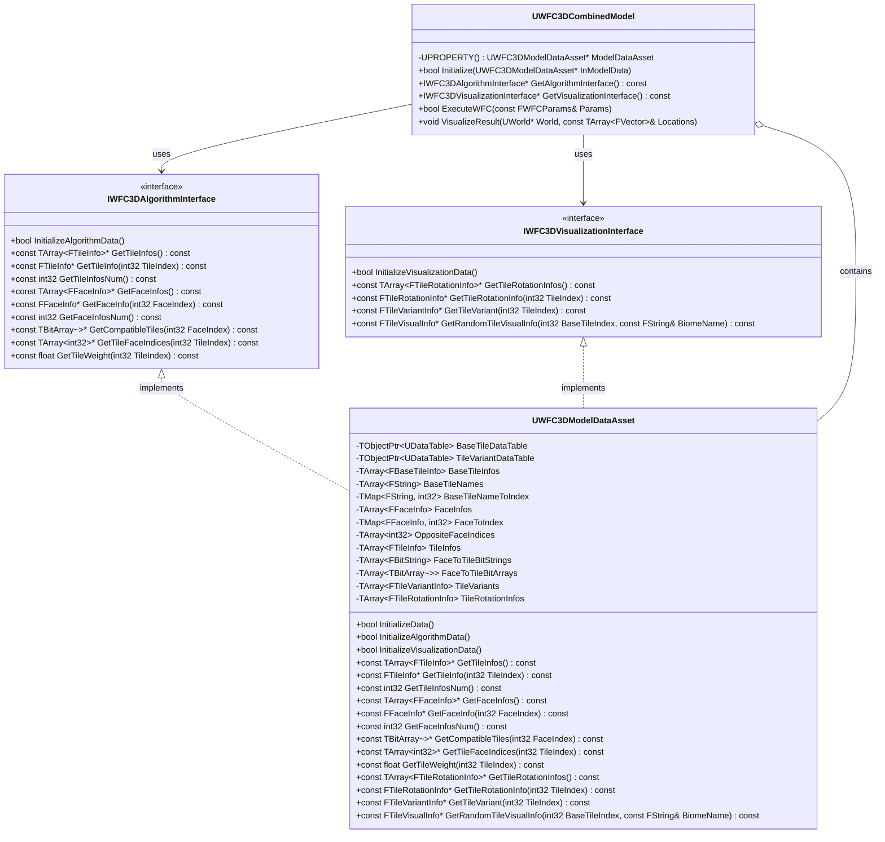

```mermaid
classDiagram
%% 인터페이스 정의
    class IWFC3DAlgorithmInterface {
        <<interface>>
        +bool InitializeAlgorithmData()
        +const TArray~FTileInfo~* GetTileInfos() const
        +const FTileInfo* GetTileInfo(int32 TileIndex) const
        +const int32 GetTileInfosNum() const
        +const TArray~FFaceInfo~* GetFaceInfos() const
        +const FFaceInfo* GetFaceInfo(int32 FaceIndex) const
        +const int32 GetFaceInfosNum() const
        +const TBitArray~>* GetCompatibleTiles(int32 FaceIndex) const
        +const TArray~int32~* GetTileFaceIndices(int32 TileIndex) const
        +const float GetTileWeight(int32 TileIndex) const
    }

    class IWFC3DVisualizationInterface {
        <<interface>>
        +bool InitializeVisualizationData()
        +const TArray~FTileRotationInfo~* GetTileRotationInfos() const
        +const FTileRotationInfo* GetTileRotationInfo(int32 TileIndex) const
        +const FTileVariantInfo* GetTileVariant(int32 TileIndex) const
        +const FTileVisualInfo* GetRandomTileVisualInfo(int32 BaseTileIndex, const FString& BiomeName) const
    }

%% 주요 클래스들
    class UWFC3DModelDataAsset {
        -TObjectPtr~UDataTable~ BaseTileDataTable
        -TObjectPtr~UDataTable~ TileVariantDataTable
        -TArray~FBaseTileInfo~ BaseTileInfos
        -TArray~FString~ BaseTileNames
        -TMap~FString, int32~ BaseTileNameToIndex
        -TArray~FFaceInfo~ FaceInfos
        -TMap~FFaceInfo, int32~ FaceToIndex
        -TArray~int32~ OppositeFaceIndices
        -TArray~FTileInfo~ TileInfos
        -TArray~FBitString~ FaceToTileBitStrings
        -TArray~TBitArray~>~ FaceToTileBitArrays
        -TArray~FTileVariantInfo~ TileVariants
        -TArray~FTileRotationInfo~ TileRotationInfos
        +bool InitializeData()
        +bool InitializeAlgorithmData()
        +bool InitializeVisualizationData()
        +const TArray~FTileInfo~* GetTileInfos() const
        +const FTileInfo* GetTileInfo(int32 TileIndex) const
        +const int32 GetTileInfosNum() const
        +const TArray~FFaceInfo~* GetFaceInfos() const
        +const FFaceInfo* GetFaceInfo(int32 FaceIndex) const
        +const int32 GetFaceInfosNum() const
        +const TBitArray~>* GetCompatibleTiles(int32 FaceIndex) const
        +const TArray~int32~* GetTileFaceIndices(int32 TileIndex) const
        +const float GetTileWeight(int32 TileIndex) const
        +const TArray~FTileRotationInfo~* GetTileRotationInfos() const
        +const FTileRotationInfo* GetTileRotationInfo(int32 TileIndex) const
        +const FTileVariantInfo* GetTileVariant(int32 TileIndex) const
        +const FTileVisualInfo* GetRandomTileVisualInfo(int32 BaseTileIndex, const FString& BiomeName) const
    }

    class UWFC3DCombinedModel {
        -UPROPERTY() UWFC3DModelDataAsset* ModelDataAsset
        +bool Initialize(UWFC3DModelDataAsset* InModelData)
        +IWFC3DAlgorithmInterface* GetAlgorithmInterface() const
        +IWFC3DVisualizationInterface* GetVisualizationInterface() const
        +bool ExecuteWFC(const FWFCParams& Params)
        +void VisualizeResult(UWorld* World, const TArray~FVector~& Locations)
    }

%% 관계 정의
    IWFC3DAlgorithmInterface <|.. UWFC3DModelDataAsset : implements
    IWFC3DVisualizationInterface <|.. UWFC3DModelDataAsset : implements
    UWFC3DCombinedModel o-- UWFC3DModelDataAsset : contains
    UWFC3DCombinedModel --> IWFC3DAlgorithmInterface : uses
    UWFC3DCombinedModel --> IWFC3DVisualizationInterface : uses
```