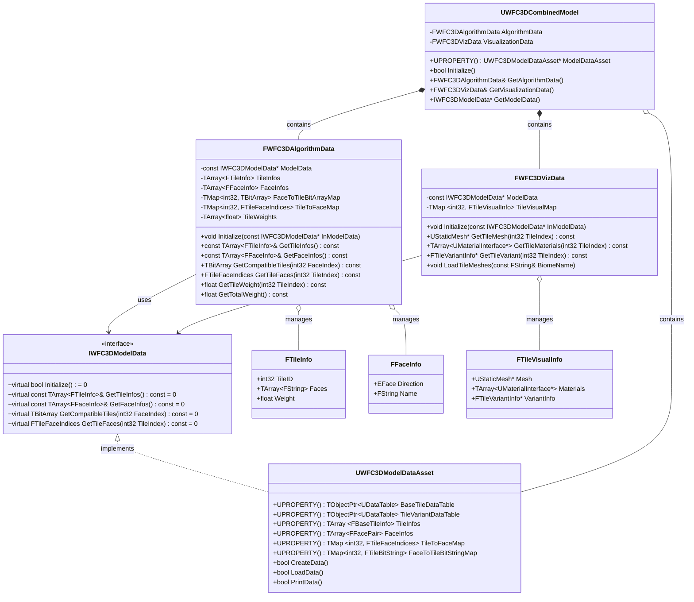

```mermaid
classDiagram
%% 모델 관련 클래스 구조
class IWFC3DModelData {
<<interface>>
+virtual bool Initialize() = 0
+virtual const TArray~FTileInfo~& GetTileInfos() const = 0
+virtual const TArray~FFaceInfo~& GetFaceInfos() const = 0
+virtual TBitArray GetCompatibleTiles(int32 FaceIndex) const = 0
+virtual FTileFaceIndices GetTileFaces(int32 TileIndex) const = 0
}

    class UWFC3DModelDataAsset {
        +UPROPERTY() TObjectPtr~UDataTable~ BaseTileDataTable
        +UPROPERTY() TObjectPtr~UDataTable~ TileVariantDataTable
        +UPROPERTY() TArray ~FBaseTileInfo~ TileInfos
        +UPROPERTY() TArray~FFacePair~ FaceInfos
        +UPROPERTY() TMap ~int32, FTileFaceIndices~ TileToFaceMap
        +UPROPERTY() TMap~int32, FTileBitString~ FaceToTileBitStringMap
        
        +bool CreateData()
        +bool LoadData()
        +bool PrintData()
    }
    
    class FWFC3DAlgorithmData {
        -const IWFC3DModelData* ModelData
        -TArray~FTileInfo~ TileInfos
        -TArray~FFaceInfo~ FaceInfos
        -TMap~int32, TBitArray~ FaceToTileBitArrayMap
        -TMap~int32, FTileFaceIndices~ TileToFaceMap
        -TArray~float~ TileWeights
        
        +void Initialize(const IWFC3DModelData* InModelData)
        +const TArray~FTileInfo~& GetTileInfos() const
        +const TArray~FFaceInfo~& GetFaceInfos() const
        +TBitArray GetCompatibleTiles(int32 FaceIndex) const
        +FTileFaceIndices GetTileFaces(int32 TileIndex) const
        +float GetTileWeight(int32 TileIndex) const
        +float GetTotalWeight() const
    }
    
    class FWFC3DVizData {
        -const IWFC3DModelData* ModelData
        -TMap ~int32, FTileVisualInfo~ TileVisualMap
        
        +void Initialize(const IWFC3DModelData* InModelData)
        +UStaticMesh* GetTileMesh(int32 TileIndex) const
        +TArray~UMaterialInterface*~ GetTileMaterials(int32 TileIndex) const
        +FTileVariantInfo* GetTileVariant(int32 TileIndex) const
        +void LoadTileMeshes(const FString& BiomeName)
    }
    
    class UWFC3DCombinedModel {
        +UPROPERTY() UWFC3DModelDataAsset* ModelDataAsset
        -FWFC3DAlgorithmData AlgorithmData
        -FWFC3DVizData VisualizationData
        
        +bool Initialize()
        +FWFC3DAlgorithmData& GetAlgorithmData()
        +FWFC3DVizData& GetVisualizationData()
        +IWFC3DModelData* GetModelData()
    }
    
    %% 새로운 데이터 구조체들
    class FTileInfo {
        +int32 TileID
        +TArray~FString~ Faces
        +float Weight
    }
    
    class FFaceInfo {
        +EFace Direction
        +FString Name
    }
    
    class FTileVisualInfo {
        +UStaticMesh* Mesh
        +TArray~UMaterialInterface*~ Materials
        +FTileVariantInfo* VariantInfo
    }
    
    
    
    %% 관계 정의
    IWFC3DModelData <|.. UWFC3DModelDataAsset : implements
    UWFC3DCombinedModel o-- UWFC3DModelDataAsset : contains
    UWFC3DCombinedModel *-- FWFC3DAlgorithmData : contains
    UWFC3DCombinedModel *-- FWFC3DVizData : contains
    FWFC3DAlgorithmData --> IWFC3DModelData : uses
    FWFC3DVizData --> IWFC3DModelData : uses
    FWFC3DAlgorithmData o-- FTileInfo : manages
    FWFC3DAlgorithmData o-- FFaceInfo : manages
    FWFC3DVizData o-- FTileVisualInfo : manages
```