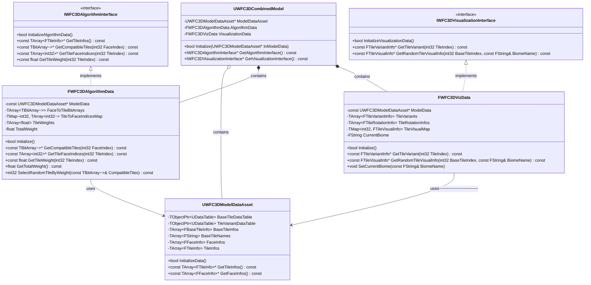

```mermaid
classDiagram
%% 인터페이스 정의
    class IWFC3DAlgorithmInterface {
        <<interface>>
        +bool InitializeAlgorithmData()
        +const TArray~FTileInfo~* GetTileInfos() const
        +const TBitArray~>* GetCompatibleTiles(int32 FaceIndex) const
        +const TArray~int32~* GetTileFaceIndices(int32 TileIndex) const
        +const float GetTileWeight(int32 TileIndex) const
    }

    class IWFC3DVisualizationInterface {
        <<interface>>
        +bool InitializeVisualizationData()
        +const FTileVariantInfo* GetTileVariant(int32 TileIndex) const
        +const FTileVisualInfo* GetRandomTileVisualInfo(int32 BaseTileIndex, const FString& BiomeName) const
    }

%% 주요 클래스들
    class UWFC3DModelDataAsset {
        -TObjectPtr~UDataTable~ BaseTileDataTable
        -TObjectPtr~UDataTable~ TileVariantDataTable
        -TArray~FBaseTileInfo~ BaseTileInfos
        -TArray~FString~ BaseTileNames
        -TArray~FFaceInfo~ FaceInfos
        -TArray~FTileInfo~ TileInfos
        +bool InitializeData()
        +const TArray~FTileInfo~* GetTileInfos() const
        +const TArray~FFaceInfo~* GetFaceInfos() const
    }

    class FWFC3DAlgorithmData {
        -const UWFC3DModelDataAsset* ModelData
        -TArray~TBitArray~>~ FaceToTileBitArrays
        -TMap~int32, TArray~int32~~ TileToFaceIndicesMap
        -TArray~float~ TileWeights
        -float TotalWeight
        +bool Initialize()
        +const TBitArray~>* GetCompatibleTiles(int32 FaceIndex) const
        +const TArray~int32~* GetTileFaceIndices(int32 TileIndex) const
        +const float GetTileWeight(int32 TileIndex) const
        +float GetTotalWeight() const
        +int32 SelectRandomTileByWeight(const TBitArray~>& CompatibleTiles) const
    }

    class FWFC3DVizData {
        -const UWFC3DModelDataAsset* ModelData
        -TArray~FTileVariantInfo~ TileVariants
        -TArray~FTileRotationInfo~ TileRotationInfos
        -TMap~int32, FTileVisualInfo~ TileVisualMap
        -FString CurrentBiome
        +bool Initialize()
        +const FTileVariantInfo* GetTileVariant(int32 TileIndex) const
        +const FTileVisualInfo* GetRandomTileVisualInfo(int32 BaseTileIndex, const FString& BiomeName) const
        +void SetCurrentBiome(const FString& BiomeName)
    }

    class UWFC3DCombinedModel {
        -UWFC3DModelDataAsset* ModelDataAsset
        -FWFC3DAlgorithmData AlgorithmData
        -FWFC3DVizData VisualizationData
        +bool Initialize(UWFC3DModelDataAsset* InModelData)
        +IWFC3DAlgorithmInterface* GetAlgorithmInterface() const
        +IWFC3DVisualizationInterface* GetVisualizationInterface() const
    }

%% 관계 정의
    IWFC3DAlgorithmInterface <|.. FWFC3DAlgorithmData : implements
    IWFC3DVisualizationInterface <|.. FWFC3DVizData : implements
    UWFC3DCombinedModel o-- UWFC3DModelDataAsset : contains
    UWFC3DCombinedModel *-- FWFC3DAlgorithmData : contains
    UWFC3DCombinedModel *-- FWFC3DVizData : contains
    FWFC3DAlgorithmData --> UWFC3DModelDataAsset : uses
    FWFC3DVizData --> UWFC3DModelDataAsset : uses~~~~~~~~~~~~~~~~
```