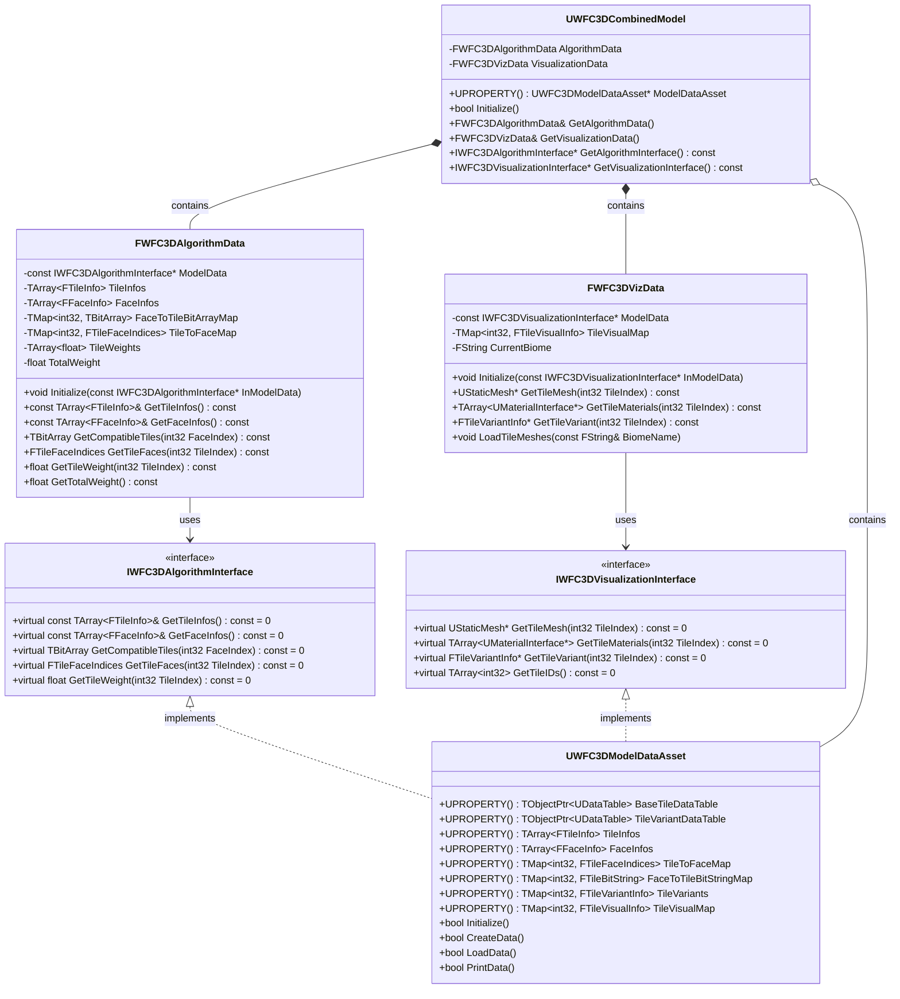

```mermaid
classDiagram
%% 인터페이스 정의
    class IWFC3DAlgorithmInterface {
        <<interface>>
        +virtual const TArray~FTileInfo~& GetTileInfos() const = 0
        +virtual const TArray~FFaceInfo~& GetFaceInfos() const = 0
        +virtual TBitArray GetCompatibleTiles(int32 FaceIndex) const = 0
        +virtual FTileFaceIndices GetTileFaces(int32 TileIndex) const = 0
        +virtual float GetTileWeight(int32 TileIndex) const = 0
    }

    class IWFC3DVisualizationInterface {
        <<interface>>
        +virtual UStaticMesh* GetTileMesh(int32 TileIndex) const = 0
        +virtual TArray~UMaterialInterface*~ GetTileMaterials(int32 TileIndex) const = 0
        +virtual FTileVariantInfo* GetTileVariant(int32 TileIndex) const = 0
        +virtual TArray~int32~ GetTileIDs() const = 0
    }

%% 데이터 에셋 및 구현 클래스
    class UWFC3DModelDataAsset {
        +UPROPERTY() TObjectPtr~UDataTable~ BaseTileDataTable
        +UPROPERTY() TObjectPtr~UDataTable~ TileVariantDataTable
        +UPROPERTY() TArray~FTileInfo~ TileInfos
        +UPROPERTY() TArray~FFaceInfo~ FaceInfos
        +UPROPERTY() TMap~int32, FTileFaceIndices~ TileToFaceMap
        +UPROPERTY() TMap~int32, FTileBitString~ FaceToTileBitStringMap
        +UPROPERTY() TMap~int32, FTileVariantInfo~ TileVariants
        +UPROPERTY() TMap~int32, FTileVisualInfo~ TileVisualMap

        +bool Initialize()
        +bool CreateData()
        +bool LoadData()
        +bool PrintData()
    }

    class FWFC3DAlgorithmData {
        -const IWFC3DAlgorithmInterface* ModelData
        -TArray~FTileInfo~ TileInfos
        -TArray~FFaceInfo~ FaceInfos
        -TMap~int32, TBitArray~ FaceToTileBitArrayMap
        -TMap~int32, FTileFaceIndices~ TileToFaceMap
        -TArray~float~ TileWeights
        -float TotalWeight

        +void Initialize(const IWFC3DAlgorithmInterface* InModelData)
        +const TArray~FTileInfo~& GetTileInfos() const
        +const TArray~FFaceInfo~& GetFaceInfos() const
        +TBitArray GetCompatibleTiles(int32 FaceIndex) const
        +FTileFaceIndices GetTileFaces(int32 TileIndex) const
        +float GetTileWeight(int32 TileIndex) const
        +float GetTotalWeight() const
    }

    class FWFC3DVizData {
        -const IWFC3DVisualizationInterface* ModelData
        -TMap~int32, FTileVisualInfo~ TileVisualMap
        -FString CurrentBiome

        +void Initialize(const IWFC3DVisualizationInterface* InModelData)
        +UStaticMesh* GetTileMesh(int32 TileIndex) const
        +TArray~UMaterialInterface*~ GetTileMaterials(int32 TileIndex) const
        +FTileVariantInfo* GetTileVariant(int32 TileIndex) const
        +void LoadTileMeshes(const FString& BiomeName)
    }

    class UWFC3DCombinedModel {
        +UPROPERTY() UWFC3DModelDataAsset* ModelDataAsset
        -FWFC3DAlgorithmData AlgorithmData
        -FWFC3DVizData VisualizationData

        +bool Initialize()
        +FWFC3DAlgorithmData& GetAlgorithmData()
        +FWFC3DVizData& GetVisualizationData()
        +IWFC3DAlgorithmInterface* GetAlgorithmInterface() const
        +IWFC3DVisualizationInterface* GetVisualizationInterface() const
    }

%% 관계 정의
    IWFC3DAlgorithmInterface <|.. UWFC3DModelDataAsset : implements
    IWFC3DVisualizationInterface <|.. UWFC3DModelDataAsset : implements
    UWFC3DCombinedModel o-- UWFC3DModelDataAsset : contains
    UWFC3DCombinedModel *-- FWFC3DAlgorithmData : contains
    UWFC3DCombinedModel *-- FWFC3DVizData : contains
    FWFC3DAlgorithmData --> IWFC3DAlgorithmInterface : uses
    FWFC3DVizData --> IWFC3DVisualizationInterface : uses
```